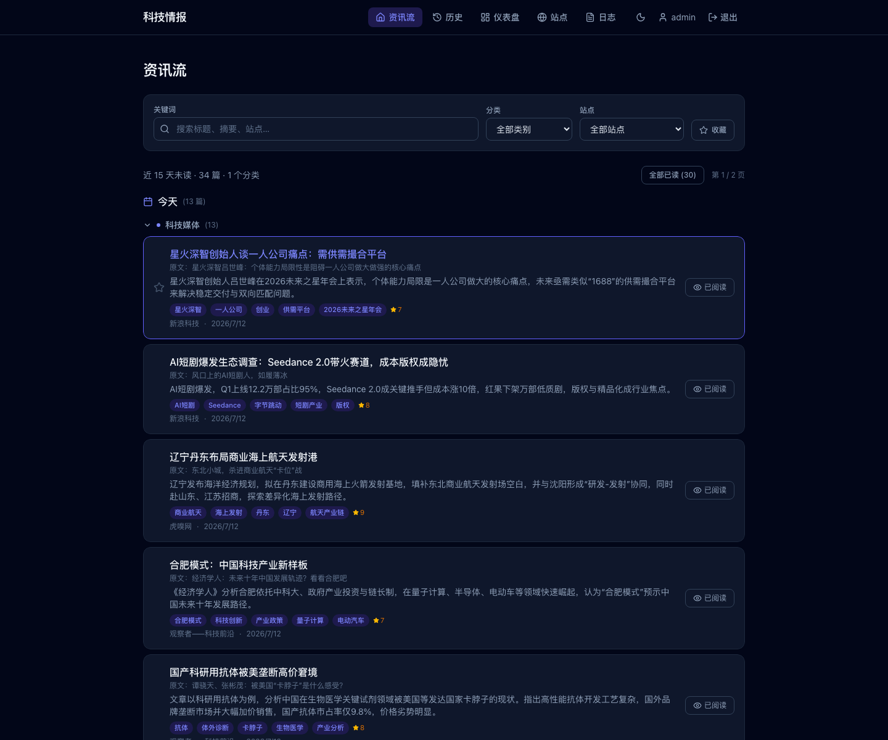
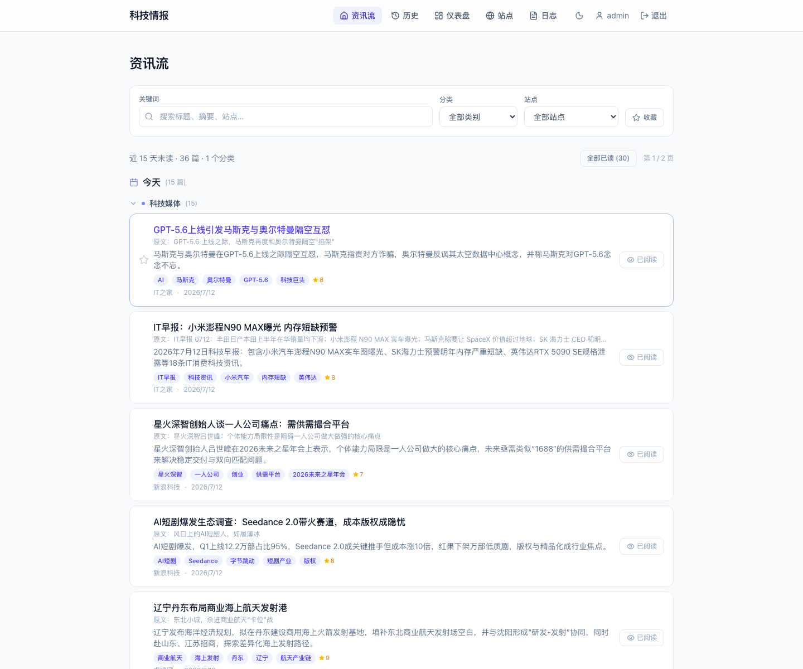
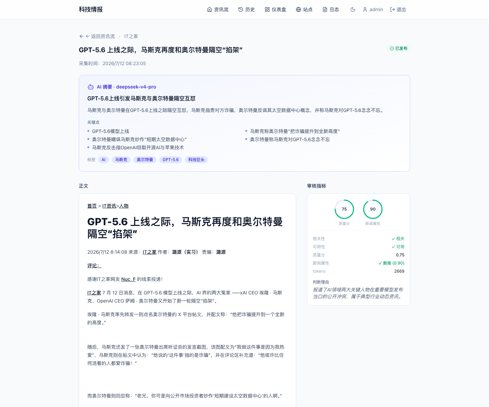
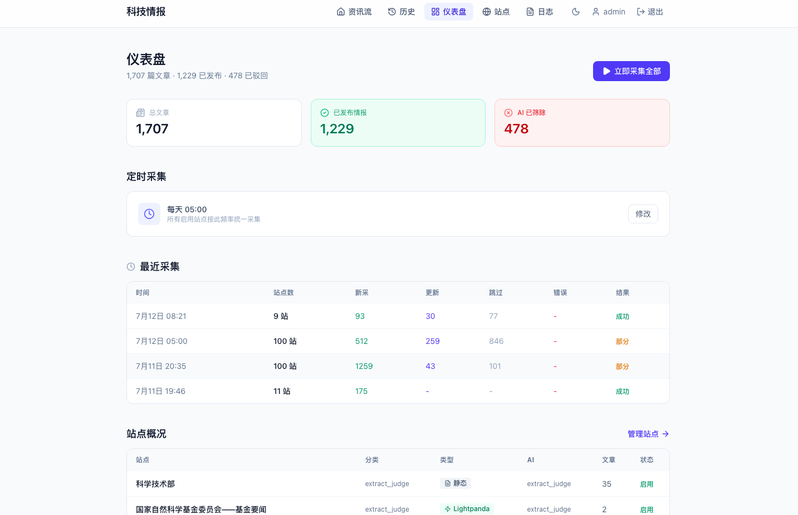
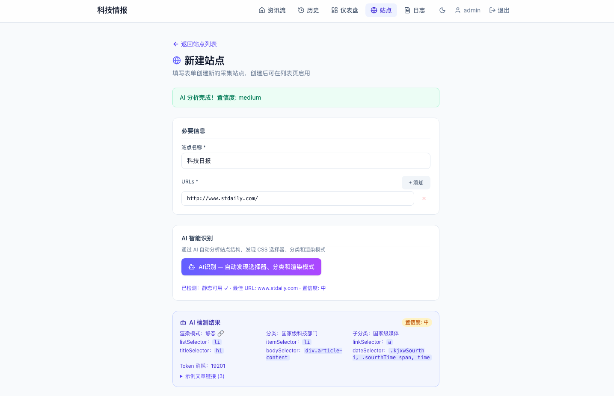
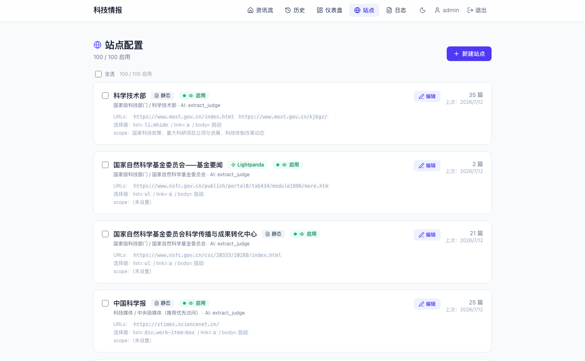
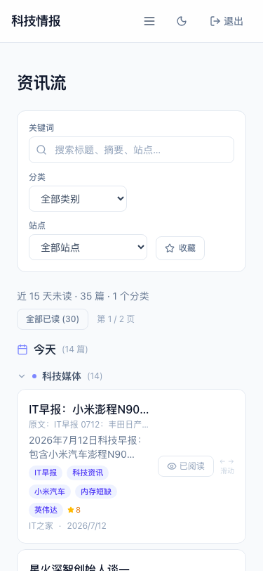
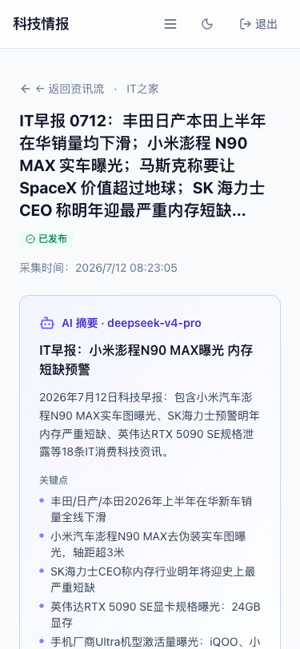
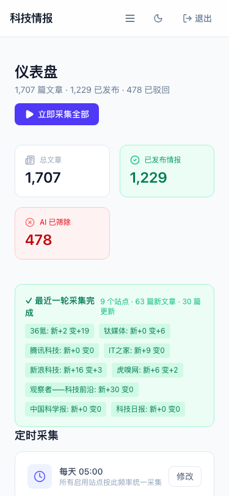

# 科技情报采集器 · Tech Info Collector

<p align="center">
  
  
  
  
  
  
</p>

<p align="center">
  <b>全自动科技情报管线</b> — 从 100+ 科技站点采集资讯，AI 审核筛选、生成摘要，智能资讯流阅读<br/>
  <sub>Automated tech intelligence pipeline — Crawl, AI-review, summarize, and read — all from one app</sub>
</p>

<br/>

<table align="center">
  <tr>
    <td align="center" valign="bottom">
      
      <br/><sub>资讯流 · 暗色模式</sub>
    </td>
    <td align="center" valign="bottom">
      
      <br/><sub>资讯流 · 浅色模式</sub>
    </td>
    <td align="center" valign="bottom">
      
      <br/><sub>文章详情 · AI 摘要 + 评分</sub>
    </td>
  </tr>
  <tr>
    <td align="center" valign="bottom">
      
      <br/><sub>仪表盘 · 统计 + 进度 + 调度</sub>
    </td>
    <td align="center" valign="bottom">
      
      <br/><sub>新建站点 · AI 智能识别</sub>
    </td>
    <td align="center" valign="bottom">
      
      <br/><sub>站点管理 · 102 站 · 三渲染引擎</sub>
    </td>
  </tr>
  <tr>
    <td align="center" valign="bottom">
      
      <br/><sub>移动资讯流 · 左滑/右滑手势</sub>
    </td>
    <td align="center" valign="bottom">
      
      <br/><sub>移动文章 · 阅读进度条</sub>
    </td>
    <td align="center" valign="bottom">
      
      <br/><sub>移动仪表盘 · 自适应</sub>
    </td>
  </tr>
</table>

---

## 📑 目录 · Table of Contents

- [✨ 功能亮点 · Features](#-功能亮点--features)
- [🏗️ 系统架构 · Architecture](#-系统架构--architecture)
- [🛠️ 技术栈 · Tech Stack](#-技术栈--tech-stack)
- [🚀 快速开始 · Quick Start](#-快速开始--quick-start)
  - [Docker 部署（推荐）](#docker-部署推荐)
  - [本地开发](#本地开发)
- [📦 命令参考 · Commands](#-命令参考--commands)
- [🧠 AI 智能管线 · AI Pipeline](#-ai-智能管线--ai-pipeline)
- [🌐 采集引擎 · Crawl Engines](#-采集引擎--crawl-engines)
- [📊 数据库 · Database](#-数据库--database)
- [🔐 认证与安全 · Auth & Security](#-认证与安全--auth--security)
- [⚙️ 环境变量 · Environment Variables](#-环境变量--environment-variables)
- [📁 项目结构 · Project Structure](#-项目结构--project-structure)
- [🌍 API 参考 · API Reference](#-api-参考--api-reference)
- [📈 架构演进 · Roadmap](#-架构演进--roadmap)
- [🤝 贡献 · Contributing](#-贡献--contributing)

---

## ✨ 功能亮点 · Features

<table>
<tr>
<td width="70%">

| 功能 | 说明 |
|------|------|
| 🤖 **智能爬虫** | LLM 自适应提取文章，**无需逐站配置 CSS 选择器** |
| 🎯 **AI 质量把关** | 自动评分、摘要、标签、新闻属性判定，按阈值发布/驳回 |
| 📰 **资讯流阅读** | 日期分组、分类折叠、全文搜索、收藏、全部已读 |
| 🌓 **暗色模式** | 自适应系统主题，手动切换持久化 |
| 📱 **响应式 + 手势** | 移动端左滑已读 / 右滑收藏，桌面端 hover 操作 |
| ⚡ **三渲染引擎** | 静态 (Cheerio) / 动态 (Playwright) / Lightpanda (~50MB 低内存) |
| 🐳 **Docker 一键部署** | docker compose up -d，内置 Lightpanda 轻量浏览器 |
| ⏰ **智能调度** | Cron 定时 + 热更新 + 漏调补偿 + 手动触发 |
| 🔒 **单用户认证** | scrypt 密码哈希 + HMAC 自签名 Token + HttpOnly Cookie |
| 📋 **站点管理** | AI 一键分析站点结构，自动发现选择器与分类 |

</td>
</tr>
</table>

---

## 🏗️ 系统架构 · Architecture

```mermaid
flowchart LR
    subgraph Triggers["触发"]
        CRON["⏰ 定时调度"]
        WEB["🖱️ Web UI"]
        CLI["💻 CLI"]
    end

    subgraph Pipeline["采集管线"]
        CRAWL["🌐 采集引擎<br/>Static / Lightpanda / Playwright"]
        SMART["🧠 智能爬虫<br/>LLM 链接筛选 + 并行详情抓取"]
        DEDUP["🔖 去重入库<br/>contentHash SHA1"]
    end

    subgraph AI["AI 审核沙盒"]
        REVIEW["🔍 结构化审核<br/>摘要 · 评分 · 标签 · 新闻判定"]
        GATE["🚦 确定性闸门<br/>combinedScore ≥ 阈值 → 发布"]
    end

    subgraph Frontend["前端展示"]
        FEED["📰 资讯流<br/>SSR + 客户端分页"]
        DETAIL["📄 文章详情<br/>Markdown + AI 审核面板"]
        DASHBOARD["📊 仪表盘<br/>统计 + 进度 + 调度"]
    end

    Triggers --> CRAWL --> SMART --> DEDUP --> REVIEW --> GATE --> Frontend
```



> 📖 详细架构分析见 [`doc/architecture-analysis.md`](doc/architecture-analysis.md) — 包含 ER 图、完整数据流、15 个 Mermaid 流程图。

**核心设计原则：LLM 只提供建议，确定性代码做最终决策。** AI 的输出经 Zod schema 强校验，最终发布/驳回由 `decideStatus()` 函数（基于 `qualityScore × 0.7 + newsScore × 0.3` 综合评分与可配置阈值）决定。

---

## 🛠️ 技术栈 · Tech Stack

| 层级 Layer | 技术 Technology | 说明 |
|------------|-----------------|------|
| **框架** | Next.js 15 (App Router) | SSR/RSC 页面 + API Route 一体化 |
| **UI** | React 19 + Tailwind CSS 4 | 暗色模式 · 响应式 · Typography 插件 |
| **语言** | TypeScript 5.7 (strict) | 全栈类型安全 |
| **数据库** | SQLite + Drizzle ORM | WAL 模式，零配置，Docker Volume 持久化 |
| **采集-静态** | Cheerio + Node.js http/https | 选择器解析 · GBK 编码 · SSL 容错 |
| **采集-动态** | Playwright (Chromium) | 完整浏览器，JS 渲染站点 |
| **采集-轻量** | Lightpanda (CDP) | ~50MB 内存，Chromium DevTools Protocol |
| **AI SDK** | Vercel AI SDK (`ai` + `@ai-sdk/openai-compatible`) | 兼容 OpenAI / DeepSeek / 通义千问 / Ollama 等 |
| **调度** | node-cron | 定时采集 + cron 热更新 + 启动补偿 |
| **限流** | p-queue | 按域名隔离并发队列 |
| **部署** | Docker + docker-compose | 双容器编排 (App + Lightpanda) |
| **包管理** | pnpm 9 | 严格依赖锁定 |

---

## 🚀 快速开始 · Quick Start

### Docker 部署（推荐）

```bash
# 1. 克隆项目
git clone <repo-url> && cd tech-info-collector

# 2. 配置环境变量
cp .env.example .env
# 编辑 .env → 填入 AI_BASE_URL / AI_API_KEY / AI_MODEL / ADMIN_PASSWORD

# 3. 启动（含 Lightpanda 轻量浏览器）
docker compose up -d --build

# 4. 确认运行
docker compose logs -f
# 看到 "✓ Ready" 后访问 http://localhost:4040

# 5. 导入种子站点（首次部署）
docker compose exec app pnpm seed

# 6. 手动执行一次采集
docker compose exec app pnpm run
```

<br/>

### 本地开发

<details>
<summary>展开本地开发步骤</summary>

```bash
# 前置条件：Node.js 22+、pnpm 9+

# 1. 安装依赖
pnpm install

# 2. 初始化数据库
pnpm db:push
pnpm seed

# 3. 配置 .env
cp .env.example .env
# 编辑 .env → 填入必需的 AI_* 变量

# 4. 启动开发服务器
pnpm dev          # http://localhost:4040

# 5. 启动 Lightpanda（可选，用于 render=lightpanda 的站点）
docker run -d --name lightpanda -p 9222:9222 lightpanda/browser:nightly

# 6. 执行采集 + 审核
pnpm crawl        # 采集全部 enabled 站点
pnpm analyze      # AI 审核所有 raw 文章
pnpm run          # crawl + analyze 一键
```
</details>

---

## 📦 命令参考 · Commands

### 容器内命令（推荐）

| 命令 Command | 说明 Description |
|-------------|-----------------|
| `docker compose up -d --build` | 构建并启动所有服务 |
| `docker compose exec app pnpm crawl` | 采集全部 enabled 站点 |
| `docker compose exec app pnpm crawl 3` | 采集指定站点 #3 |
| `docker compose exec app pnpm analyze` | AI 审核所有 raw 文章 |
| `docker compose exec app pnpm run` | 采集 + 审核一键执行 |
| `docker compose exec app pnpm scheduler` | 独立启动定时调度器 |
| `docker compose exec app pnpm seed` | 重新导入种子站点 |
| `docker compose exec app pnpm db:push` | 推送数据库 Schema |
| `docker compose exec app pnpm db:studio` | 启动 Drizzle Studio |
| `docker compose logs -f` | 实时查看日志 |
| `docker compose restart` | 重启服务 |

### 本地命令

| 命令 | 说明 |
|------|------|
| `pnpm dev` | 开发服务器 (localhost:4040) |
| `pnpm build` | 生产构建 |
| `pnpm start` | 生产启动 |
| `pnpm typecheck` | TypeScript 类型检查 |
| `pnpm crawl [siteId]` | CLI 采集 |
| `pnpm analyze [siteId] [--limit N]` | CLI AI 审核 |
| `pnpm scheduler` | 独立定时调度进程 |

---

## 🧠 AI 智能管线 · AI Pipeline

### 智能爬虫 (Intelligent Crawl)

```
站点 URL 列表
  │
  ├─ Phase 1: 多 URL 兜底
  │   ├─ 抓取列表页 HTML
  │   ├─ Cheerio 预筛选所有候选链接 (去噪、去重)
  │   └─ LLM 从紧凑链接列表中筛选文章链接 (仅 ~2KB 输入)
  │
  └─ Phase 2: 并行详情抓取
      ├─ 按域名限流 (p-queue: 3并发/域名, 2s 窗口)
      ├─ Promise.allSettled 批量抓取
      ├─ Cheerio 通用主内容抽取 (含 ≥2 个 p 的最优容器)
      └─ HTML → Markdown (Turndown)
```

> **关键优化**：LLM 不分析原始 HTML（50-100KB），而是筛选预提取的链接列表（2-5KB），大幅降低延迟和 token 消耗。

### AI 审核沙盒 (Review Sandbox)

| 安全边界 | 机制 |
|----------|------|
| **输入截断** | title ≤ 200 字，body ≤ 6,000 字 |
| **Prompt 注入防护** | 15+ 正则模式过滤（ignore previous instructions 等） |
| **无工具集** | LLM 无法调用函数，无法访问网络/文件/数据库 |
| **输出校验** | Zod schema 强校验，不合规输出直接抛异常 |
| **低温度 + 日期兜底** | temperature=0.2，未来日期自动修正 |
| **确定性闸门** | `decideStatus()` 代码决定最终状态，LLM 输出仅是建议 |

**审核输出（reviewArticle）**：

| 字段 | 类型 | 说明 |
|------|------|------|
| `headline` | string ≤30字 | 资讯流短标题 |
| `summary` | string ≤100字 | 中文摘要 |
| `keyPoints` | string[] 3-5 | 关键信息点 |
| `tags` | string[] 2-5 | 主题标签 |
| `qualityScore` | 0-1 | 情报价值/可用性评分 |
| `newsScore` | 0-1 | 新闻属性评分 |
| `isNews` | boolean | 是否为新闻/资讯 |
| `usable` | boolean | 是否真实可用（非噪声/导航） |
| `contentDate` | YYYY-MM-DD | 内容实际日期（LLM 推断） |

**发布决策**：

```
combinedScore = qualityScore × 0.7 + newsScore × 0.3

if !usable                          → rejected
if combinedScore < PUBLISH_THRESHOLD (默认 0.5) → rejected
else                                → published (自动发布)
```

### 内容去重复用

相同 `contentHash`（SHA1 16位hex）的文章自动复用已有审核结果，**零额外 token 消耗**。

---

## 🌐 采集引擎 · Crawl Engines

| 引擎 | 渲染 | 内存 占用 | 适用场景 | 不适用 |
|------|------|----------|----------|--------|
| **Static** | Node.js `http.get` | ~10MB | 服务端渲染、静态 HTML | SPA、JS 动态加载 |
| **Lightpanda** | CDP WebSocket | ~50MB | 轻度 JS 渲染 | 复杂 SPA |
| **Dynamic** | Playwright Chromium | ~200-400MB | 重度 SPA、复杂交互 | 静态站点（浪费资源） |

### Static 引擎特性

- **跨协议重定向**：支持 HTTP → HTTPS 自动跟随（max 8 跳）
- **Cookie 转发**：重定向链中携带 Set-Cookie（如 moj.gov.cn）
- **SSL 容错**：标准 TLS → 失败自动回退到非 ECDHE 密码套件（如 stic.sz.gov.cn）
- **编码识别**：`content-type header` > `<meta charset>` > `utf-8`
- **指数退避重试**：1s → 2s → 4s，最多 3 次

---

## 📊 数据库 · Database

SQLite (WAL 模式)，6 张核心表：

| 表 Table | 说明 Description | 关键字段 |
|----------|-----------------|---------|
| `users` | 单用户认证 | username, password_hash, auth_token |
| `sites` | 站点配置 | name, urls(JSON), render, ai_involvement, selectors, scope |
| `articles` | 采集文章 | url(UNIQUE), title, body(MD), content_hash, status, viewed_at, saved_at |
| `ai_reviews` | AI 审核记录 | article_id, model, summary, headline, quality_score, news_score, usable |
| `crawl_sessions` | 采集会话 | site_count, total_fetched/updated/skipped/errors, status |
| `run_logs` | 单站运行日志 | crawl_session_id, site_id, fetched/updated/skipped/error_count |
| `settings` | 系统配置 | key-value (cron_interval 等) |

**文章状态机**：`raw → analyzing → published / rejected`

> 📊 数据库 ER 图详见 [`doc/architecture-analysis.md`](doc/architecture-analysis.md#41-er-图)

---

## 🔐 认证与安全 · Auth & Security

### 认证流程

```
登录 POST /api/auth/login → 验证密码 (scrypt) → 签发 HMAC Token
     → Set-Cookie: auth_token (HttpOnly, SameSite=Lax, 30天)

请求 middleware.ts → 检查 auth_token cookie → 放行/302 /login
     layout.tsx → 验证 Token 签名 + 确认用户存在 → 渲染页面/清空状态
```

### 安全措施

- 🔑 **密码**：scrypt (32B salt + 64B key) + timingSafeEqual 恒定时间比较
- 🎫 **Token**：自签名 HMAC-SHA256，无状态，无需数据库查 session
- 🍪 **Cookie**：HttpOnly（防 XSS）、SameSite=Lax（防 CSRF）
- 🛡️ **API**：站点编辑白名单过滤、枚举值校验、外键保护（有文章禁止删站点）
- 🤖 **AI**：6 层沙盒边界（输入截断 → 注入防护 → 无工具 → Zod 校验 → 低温度 → 确定性闸门）

---

## ⚙️ 环境变量 · Environment Variables

### 必填 · Required

| 变量 Variable | 说明 Description |
|--------------|-----------------|
| `AI_BASE_URL` | OpenAI 兼容 API 端点 (如 `https://api.deepseek.com/v1`) |
| `AI_API_KEY` | API 密钥 |
| `AI_MODEL` | 模型名 (如 `deepseek-chat`, `qwen-plus`, `gpt-4o-mini`) |

### 可选 · Optional

| 变量 | 默认值 | 说明 |
|------|--------|------|
| `AI_TIMEOUT_MS` | `60000` | 单次 AI 调用超时 (ms) |
| `AI_REVIEW_TIMEOUT_MS` | `60000` | 单篇审核超时 (ms) |
| `AI_PUBLISH_THRESHOLD` | `0.5` | 自动发布阈值 (0-1) |
| `ADMIN_USERNAME` | `admin` | 管理员用户名 |
| `ADMIN_PASSWORD` | `change-me` | 管理员密码（**生产必须修改**） |
| `AUTH_SECRET` | `dev-secret-change-me` | Token 签名密钥（**生产必须修改**） |
| `CRAWL_CONCURRENCY` | `10` (Docker 默认 `3`) | 跨域名并行组数 |
| `CRAWL_PER_DOMAIN` | `3` | 同域名内并行请求数 |
| `CRAWL_SITE_TIMEOUT_MS` | `300000` | 单站点采集超时 (5分钟) |
| `CRON_INTERVAL` | `0 9 * * *` | 定时调度 cron（每天 9:00） |
| `INTELLIGENT_CRAWL_ENABLED` | — (当前始终启用) | 智能爬虫开关 |
| `INTELLIGENT_CRAWL_MAX_ITEMS` | `30` | 单站点最多抓取文章数 |
| `LIGHTPANDA_WS_ENDPOINT` | `ws://127.0.0.1:9222` | Lightpanda CDP 地址 |
| `NOTIFY_WEBHOOK_URL` | — | 采集完成通知 Webhook |

---

## 📁 项目结构 · Project Structure

```
tech-info-collector/
│
├── app/                          # Next.js App Router (页面 + API)
│   ├── layout.tsx                # 根布局 (导航/主题/Toast)
│   ├── page.tsx                  # 首页 → 资讯流
│   ├── feed/page.tsx             # 资讯流 (redirect /)
│   ├── dashboard/page.tsx        # 仪表盘 (统计/进度/调度/站点概况)
│   ├── history/page.tsx          # 已读历史 (按阅读时间倒序)
│   ├── login/page.tsx            # 登录页
│   ├── articles/[id]/page.tsx    # 文章详情 (MD正文 + AI摘要 + 审核指标)
│   ├── sites/                    # 站点管理 (列表/编辑/新建/一键AI分析)
│   ├── runs/page.tsx             # 采集运行日志
│   ├── components/               # 共享 UI 组件 (18个)
│   │   ├── FeedList.tsx          # 资讯流核心 (搜索/筛选/分页/分组/全部已读)
│   │   ├── FeedCard.tsx          # 文章卡片 (hover按钮 + 移动端滑动)
│   │   ├── ActionButtons.tsx     # 采集/停止按钮 (轮询进度)
│   │   ├── LiveProgress.tsx      # 实时采集进度条
│   │   ├── ScheduleSection.tsx   # 定时调度配置 + Cron选择器
│   │   ├── ScoreRing.tsx         # SVG 环形评分图
│   │   ├── AnimatedNumber.tsx    # 数字滚动动画 (ease-out quad)
│   │   ├── ReadingProgress.tsx   # 阅读进度条
│   │   ├── ThemeProvider.tsx     # 明暗主题 (FOUC防护)
│   │   ├── Toast.tsx             # Toast 通知系统 (Context + 自动消失)
│   │   └── ...                   # 更多组件
│   └── api/                      # API 路由 (23个端点)
│
├── src/                          # 核心业务逻辑
│   ├── pipeline/                 # 采集编排层
│   │   ├── service.ts            # 统一入口 (CLI/Web/Cron 共用)
│   │   ├── runner.ts             # 单站点采集 + 去重入库
│   │   ├── dedup.ts              # 内容指纹 (SHA1 16位hex)
│   │   ├── abort.ts              # 采集中止信号 (模块单例)
│   │   ├── cli.ts                # CLI 入口
│   │   └── types.ts              # 共享类型
│   │
│   ├── crawler/                  # 采集引擎
│   │   ├── fetcher.ts            # HTML 抓取器 (3引擎统一接口)
│   │   ├── parser.ts             # Cheerio 选择器解析
│   │   ├── playwright.ts         # Playwright 浏览器池
│   │   ├── lightpanda.ts         # Lightpanda CDP 客户端
│   │   ├── html-to-markdown.ts   # HTML→MD (Turndown)
│   │   ├── intelligent.ts        # HTML 清洗 + Prompt注入防护
│   │   └── rate-limit.ts         # 按域名限流队列
│   │
│   ├── ai/                       # AI 模块
│   │   ├── sandbox.ts            # AI 沙盒核心 (边界/闸门)
│   │   ├── schemas.ts            # Zod 审核输出 schema
│   │   ├── analyze.ts            # 审核批处理 (contentHash复用)
│   │   ├── intelligent-crawl.ts  # 智能爬虫编排 (两阶段)
│   │   └── site-analyzer.ts      # 站点 AI 结构分析
│   │
│   ├── scheduler/cron.ts         # 定时调度 (热更新+补偿)
│   ├── notify/notifier.ts        # 通知器 (Console + Webhook)
│   ├── data/feed.ts              # 资讯流数据层 (去重SQL)
│   └── lib/                      # 工具库 (密码/日期/标签)
│
├── db/                           # 数据库
│   ├── schema.ts                 # Drizzle ORM 表定义 (6表)
│   └── client.ts                 # 连接 + WAL 模式
│
├── scripts/                      # 部署脚本
│   ├── docker-entrypoint.sh      # 容器入口
│   ├── init-db.cjs               # 运行时建表 + 幂等迁移
│   └── build-init-db.cjs         # 构建时建表
│
├── data/
│   └── sites.seed.json           # 种子站点数据
│
├── docker-compose.yml            # 双服务编排 (app + lightpanda)
├── Dockerfile                    # 多阶段构建 (deps→builder→runner)
├── middleware.ts                 # Auth 中间件
├── instrumentation.ts            # 启动自动开启调度器
└── .env.example                  # 环境变量模板
```

---

## 🌍 API 参考 · API Reference

### 资讯流 · Feed

| 方法 | 路径 | 说明 |
|------|------|------|
| `GET` | `/api/feed?page=1&pageSize=30` | 分页资讯流（近15天未读） |
| `GET` | `/api/feed?saved=1` | 仅收藏文章 |
| `POST` | `/api/articles/[id]/view` | 标记已读（含 contentHash 级联） |
| `POST` | `/api/articles/view-batch` | 批量标记已读 |
| `POST` | `/api/articles/[id]/save` | 切换收藏状态 |

### 站点管理 · Sites

| 方法 | 路径 | 说明 |
|------|------|------|
| `GET` | `/api/sites` | 站点列表（含文章计数） |
| `POST` | `/api/sites` | 创建站点 |
| `GET` | `/api/sites/[id]` | 单站点详情 |
| `PATCH` | `/api/sites/[id]` | 更新站点（白名单过滤） |
| `DELETE` | `/api/sites/[id]` | 删除站点（有文章时阻止） |
| `POST` | `/api/sites/[id]/toggle` | 切换启用/禁用 |
| `POST` | `/api/sites/batch/toggle` | 批量切换 |
| `POST` | `/api/sites/analyze` | AI 一键分析站点结构 |

### 采集 · Crawl

| 方法 | 路径 | 说明 |
|------|------|------|
| `POST` | `/api/crawl` | 手动触发采集（后台异步） |
| `POST` | `/api/crawl/stop` | 中止当前采集 |
| `GET` | `/api/runs` | 分页运行日志 |
| `GET` | `/api/runs/active` | 实时进度（running + recent） |

### 认证 · Auth

| 方法 | 路径 | 认证 | 说明 |
|------|------|------|------|
| `POST` | `/api/auth/login` | ❌ | 登录 |
| `POST` | `/api/auth/logout` | ❌ | 退出 |
| `GET` | `/api/auth/me` | ❌ | 当前用户 |
| `GET` | `/api/health` | ❌ | 健康检查（Docker healthcheck） |

### 调度 · Schedule

| 方法 | 路径 | 说明 |
|------|------|------|
| `GET` | `/api/settings/schedule` | 获取 cron 配置 |
| `PATCH` | `/api/settings/schedule` | 更新 cron 配置（热生效） |

---

## 📈 架构演进 · Roadmap

```
v0: 手动写死选择器           → 选择器驱动爬虫
v1: 选择器存 DB              → sites 表存储 CSS 选择器
v2: AI 辅助配置              → site-analyzer.ts 一键分析
v3: 全 AI 驱动               → 智能爬虫 intelligent-crawl.ts ✅  (当前)
v4: 多用户 / 团队协作        → 计划中
v5: 通知渠道扩展             → Email / 钉钉 / 飞书 / Slack
v6: 多语言国际化             → i18n (en / zh)
```

---

## 🤝 贡献 · Contributing

本项目为个人项目，欢迎 Issue 和 PR。

### 本地开发环境搭建

```bash
# 1. Fork + Clone
git clone <your-fork-url> && cd tech-info-collector

# 2. 安装依赖
pnpm install

# 3. 初始化数据库
cp .env.example .env   # 配置必需的 AI_* 变量
pnpm db:push
pnpm seed

# 4. 启动开发
pnpm dev               # http://localhost:4040

# 5. 类型检查
pnpm typecheck
```

### 提交规范

- 使用语义化 Commit Message：`feat:` / `fix:` / `docs:` / `refactor:` / `chore:`
- PR 前请确保 `pnpm typecheck` 通过
- 重大变更请先开 Issue 讨论

---

<p align="center">
  <sub>Built with ❤️ using Next.js · React · TypeScript · SQLite · Playwright · Vercel AI SDK · Lightpanda</sub>
</p>
