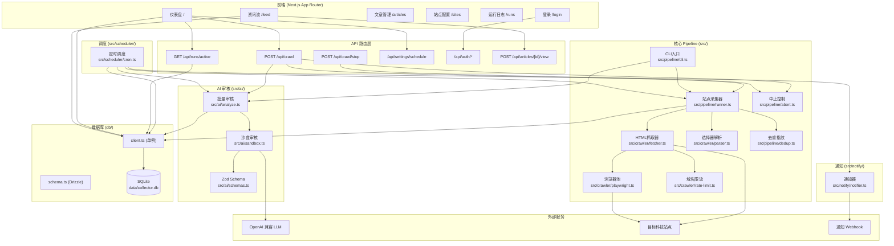
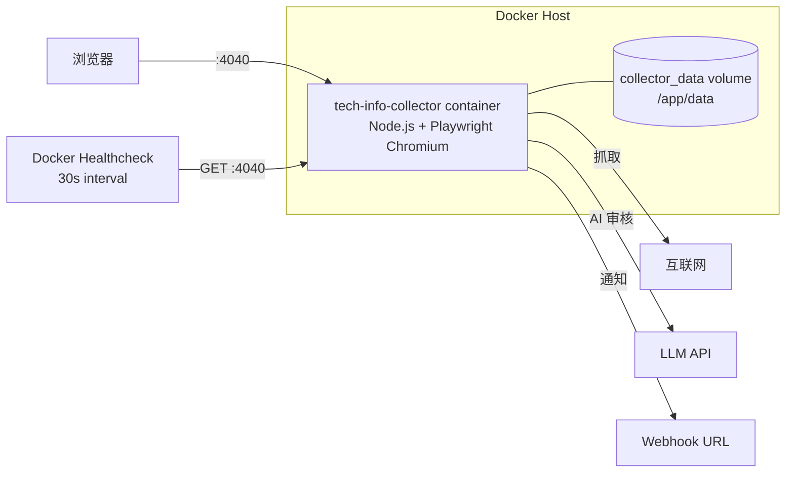
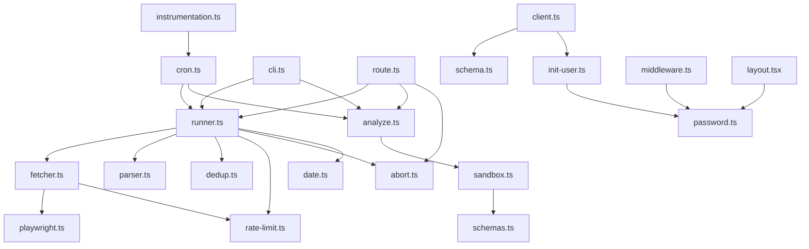
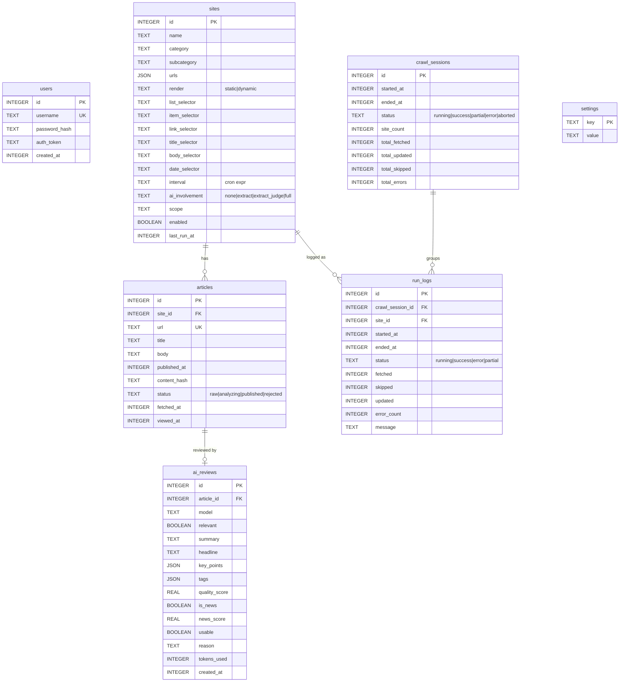
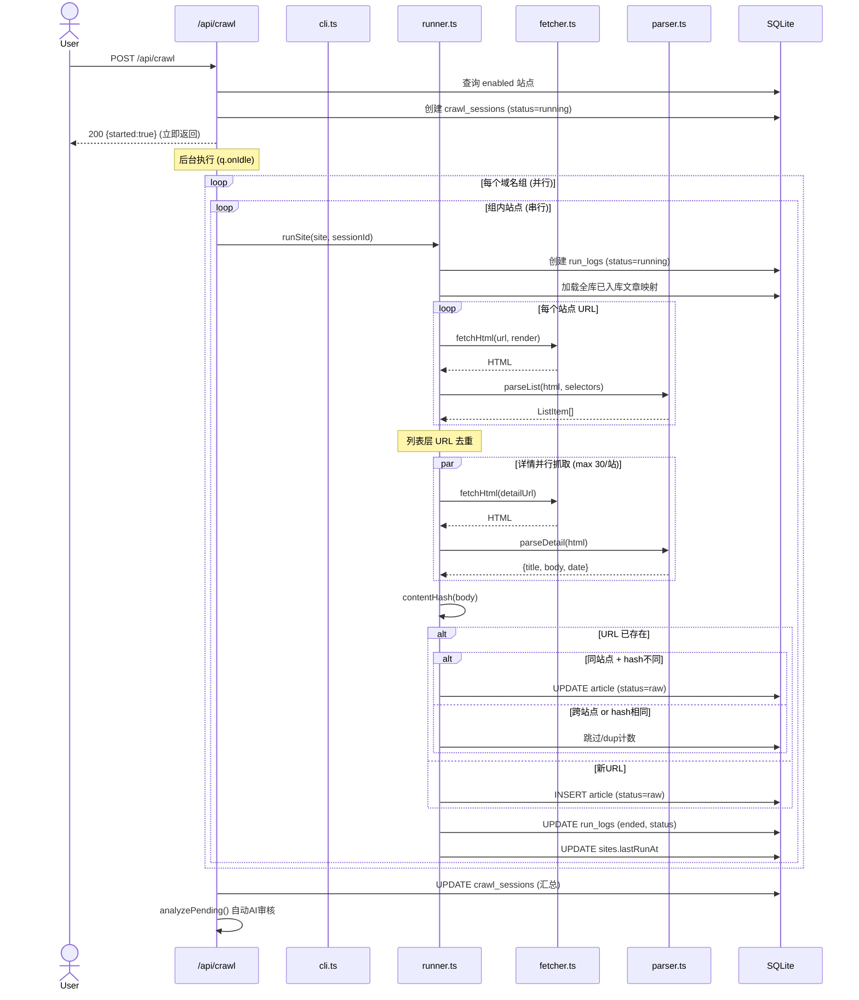
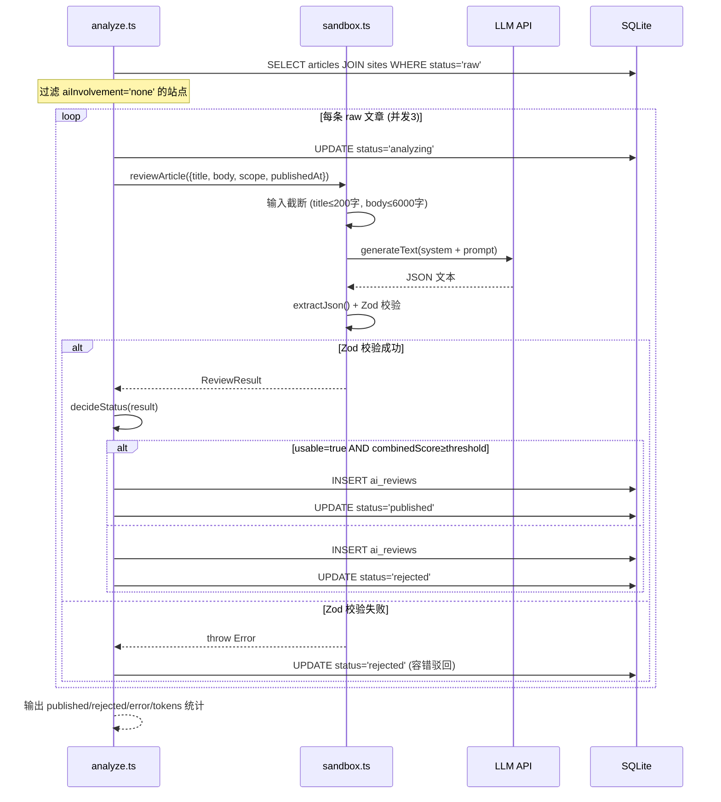
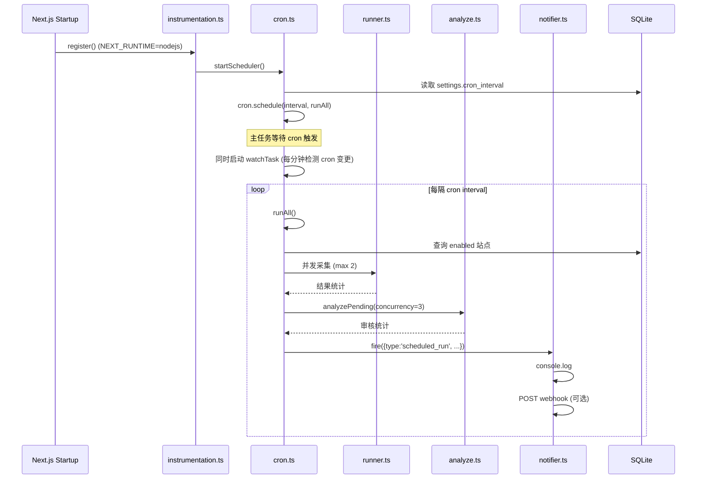
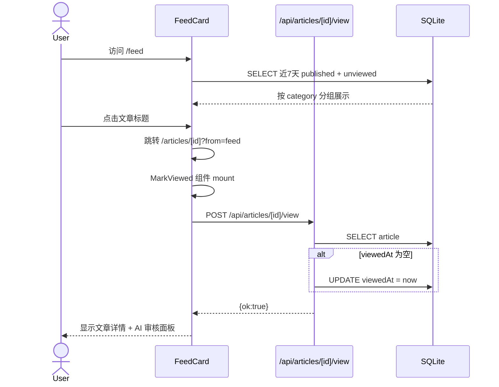
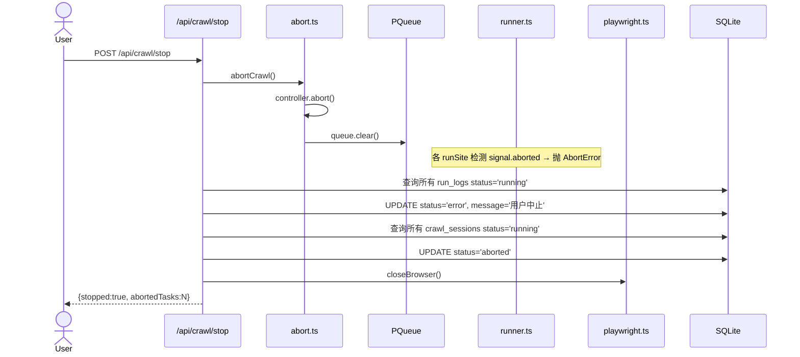

# 科技情报采集器 — 全面架构分析与缺陷评估

> **分析日期**: 2026-07-04  
> **代码版本**: `ca38ed9` (refactor: 去除人工复核，LLM综合加权打分自动过滤发布)  
> **分析范围**: 全部源码（含前端页面、API路由、采集管道、AI审核、调度、数据库、部署）

---

## 目录

1. [项目概览](#1-项目概览)
2. [技术栈](#2-技术栈)
3. [系统架构](#3-系统架构)
4. [数据库设计](#4-数据库设计)
5. [核心功能流程](#5-核心功能流程)
6. [模块详解](#6-模块详解)
7. [缺陷与风险分析](#7-缺陷与风险分析)
8. [改进建议](#8-改进建议)

---

## 1. 项目概览

基于 Next.js 15 的全栈科技情报采集器，核心功能是：**定时抓取 100+ 个科技站点 → AI 自动审核/摘要 → 资讯流展示**。支持手动触发、进度展示、中止采集。

**核心数据规模**: 101 个种子站点（87 个已启用），覆盖国家级科技部门、地方科技局、科技媒体、科研院所、显示技术、新能源等行业。

---

## 2. 技术栈

| 层 | 技术选型 | 备注 |
|---|---|---|
| 框架 | Next.js 15 (App Router) + React 19 | `force-dynamic` 渲染 |
| 语言 | TypeScript 5.7 | 严格模式 |
| 数据库 | SQLite (`better-sqlite3`) + Drizzle ORM | 同步驱动，WAL 模式 |
| 静态采集 | Cheerio (HTML 解析) + 原生 http/https | SSL 回退、GBK 编码、跨协议重定向 |
| 动态采集 | Playwright (Chromium headless) | 浏览器池单例复用 |
| AI 服务 | Vercel AI SDK (`generateText`) + OpenAI 兼容 API | 低温度 0.2、Zod schema 校验 |
| 调度 | `node-cron` + Next.js instrumentation | cron 热更新 |
| 并发控制 | `p-queue` | 域名隔离限流 |
| 样式 | Tailwind CSS 4 | |
| 容器化 | Docker + docker-compose | Debian-slim 镜像 |

---

## 3. 系统架构

### 3.1 总体架构图



### 3.2 部署架构



### 3.3 模块依赖关系



---

## 4. 数据库设计

### 4.1 ER 图



### 4.2 关键设计决策

| 决策 | 理由 | 权衡 |
|---|---|---|
| `articles.url` UNIQUE | URL 作为自然主键去重 | 无法处理同一 URL 下多篇文章的情况 |
| `ai_reviews` 与 `articles` 一对多 | 理论上一条文章可被多次审核 | 实际代码每次只取最新一条 review |
| `content_hash` 用于变更检测 | SHA1 16字符，轻量对比 | 64位碰撞风险（~2^32条后） |
| `settings` 仅 `cron_interval` 一个 key | MVP 简单 | 扩展性差，无类型区分 |
| `users` 表设计为多行但仅允许单用户 | 历史原因 | 实际在 `init-user.ts` 中硬编码为单用户 |
| 时间戳全部用 `INTEGER(unixepoch)` | SQLite 原生，跨语言一致 | 查询可读性差，需手动转换 |

---

## 5. 核心功能流程

### 5.1 采集流程



### 5.2 AI 审核流程



### 5.3 定时调度流程



### 5.4 资讯流阅读流程



### 5.5 中止采集流程



---

## 6. 模块详解

### 6.1 采集管道 (`src/pipeline/`)

#### `cli.ts` — CLI 入口
- 支持 `pnpm crawl [siteId]` 选择性采集
- 按域名分组，同域名串行、跨域名并行
- 采集后自动触发 AI 分析
- 与 `route.ts` 逻辑重复度 80%

#### `runner.ts` — 单站采集编排
- **核心函数**: `runSite(site, crawlSessionId?)`
- 每次执行加载全库 existing 文章 Map（潜在内存问题）
- 每站最多抓取 30 篇文章详情
- 详情抓取全部并行（通过 `Promise.allSettled`）
- 更新检测：同站点 + contentHash 不同 → 重置 `status='raw'`

#### `abort.ts` — 中止信号
- 模块级单例 `AbortController`
- `createAbortController(pq)` 绑定 PQueue 引用
- `abortCrawl()` 同时 abort controller + clear queue

### 6.2 采集器 (`src/crawler/`)

#### `fetcher.ts` — HTML 抓取器
- **static**: 原生 `http`/`https` 模块，支持：
  - HTTP→HTTPS 跨协议重定向（最多 8 跳）
  - SSL 回退密码套件（禁用 ECDHE 绕过 bad ecpoint）
  - GBK 编码自动识别
  - Set-Cookie 转发（终止重定向循环）
  - 指数退避重试（最多 3 次）
- **dynamic**: 委托 `playwright.ts`
- 默认超时：static 30s, dynamic 45s

#### `playwright.ts` — 动态渲染
- 单例 Browser 复用，每次抓取开独立 context
- `domcontentloaded` + `networkidle` 等待策略
- 额外 800ms 固定等待（可能不够某些 SPA）

#### `parser.ts` — 选择器解析
- `parseList`: 列表页 → 条目级提取 `{url, title, date}`
- `parseDetail`: 详情页 → 通用主内容抽取（回退机制）
  - 优先 bodySelector
  - 回退到 `extractMainContent`: 找含 ≥2 个 `<p>` 且文本最长的容器
  - 自动清洗 `script,style,nav,aside,form,.comment,.share,.breadcrumb`
- 正文截断 20000 字符

#### `rate-limit.ts` — 域名限流
- 每个 host 独立 PQueue
- `concurrency: 3`, `interval: 2000ms`, `intervalCap: 3`
- 全局 Map 缓存 queue 实例（永不释放）

### 6.3 AI 审核 (`src/ai/`)

#### `sandbox.ts` — 安全沙盒
- **边界控制**:
  - 输入硬截断：title 200字, body 6000字
  - 输出 Zod schema 强校验
  - 低温度 0.2
  - 无工具调用
- **JSON 提取策略**: 支持 ````json` 代码块或裸 JSON
- **温度**: 0.2（低随机性）
- **Provider**: 单例 `LanguageModel`（通过环境变量配置）

#### `schemas.ts` — Zod 输出 Schema
- 字段：`relevant`, `summary`, `headline`, `keyPoints`, `tags`, `qualityScore`, `usable`, `isNews`, `newsScore`, `reason`
- `qualityScore`: 0-1
- `newsScore`: ≥0.7 明确新闻, 0.4-0.7 半新闻, <0.4 非新闻

#### `analyze.ts` — 批量审核
- 查询 `status='raw'` AND `aiInvolvement != 'none'` 的文章
- 并发数默认 3（可配置）
- 失败直接驳回（无重试）
- `decideStatus` 算法：
  ```
  if !usable → rejected
  combinedScore = qualityScore × 0.7 + newsScore × 0.3
  if combinedScore < AI_PUBLISH_THRESHOLD(default 0.5) → rejected
  else → published
  ```

### 6.4 调度与通知

#### `scheduler/cron.ts`
- 启动时读取 `settings.cron_interval`（默认每天 9:00）
- 并发限制：采集 max 2（低于 CLI 和 API 的 10）
- cron 热更新：每秒检测一次 settings 变更（每分钟 cron）
- 通知：采集完成后调用 `notifier.fire()`

#### `notify/notifier.ts`
- 可插拔设计：`logNotify` + `webhookNotify`
- `NOTIFY_WEBHOOK_URL` 环境变量控制 webhook

### 6.5 Web 前端

#### 页面结构

| 路由 | 组件 | 功能 |
|---|---|---|
| `/` | `Home` (SSR) | 仪表盘：统计、进度、调度、最近采集、站点概况 |
| `/feed` | `FeedPage` (SSR) | 资讯流：近7天未读、按分类分组 |
| `/articles` | `ArticlesPage` (SSR) | 文章管理：按状态筛选 |
| `/articles/[id]` | `ArticleDetailPage` (SSR) | 文章详情 + AI 审核面板 |
| `/sites` | `SitesPage` (SSR) | 站点配置展示 |
| `/runs` | `RunsPage` (SSR) | 运行日志 |
| `/login` | `LoginPage` (CSR) | 登录表单 |

#### 认证流程
```
middleware.ts: 检查 auth_token cookie 存在性 → 无则重定向 /login
layout.tsx:    验证 token 签名 → 查询用户 → 传递 user 给组件
login API:     HMAC 签名 token → Set-Cookie (30天)
```

### 6.6 辅助工具

| 工具 | 用途 |
|---|---|
| `src/crawler/inspect.ts` | 站点结构探测（分析"像文章"的链接模式） |
| `src/crawler/probe.ts` | 容器级选择器探测 |
| `src/config/discover-selectors.ts` | 批量自动发现 CSS 选择器并写 DB |
| `src/config/discover-dynamic.ts` | 动态渲染站点选择器发现 |
| `src/config/sync-selectors-to-json.ts` | DB → sites.json 同步 |
| `src/config/seed.ts` | 种子数据导入（10个MVP站点） |
| `src/config/seed-remaining.ts` | 追加导入其余 90 个站点 |

---

## 7. 缺陷与风险分析

### 7.1 🔴 高风险

#### D1. SQLite 同步驱动阻塞事件循环

**位置**: `db/client.ts`, 所有 DB 操作

`better-sqlite3` 是同步驱动。每次 DB 查询都会阻塞 Node.js 事件循环。采集一个站点需要：
- 加载全库 existing Map（1 次查询）
- 写入 run_logs（2 次）
- 每个详情页 INSERT/UPDATE（最多 30 次）
- 更新 sites.lastRunAt（1 次）

在 ARM/Docker 环境下同步 IO 性能更差，可能导致 Web 请求响应超时。

#### D2. 全库文章数据加载到内存

**位置**: `src/pipeline/runner.ts:56-67`

```typescript
const existing = new Map<string, ExistingEntry>(
  db.select({ url, id, siteId, hash })
    .from(schema.articles)
    .all()
    .map(...)
);
```

随着文章数量增长（假设每站每天 10 篇 × 87 站点 = 870 篇/天，一年 ~30 万篇），每次采集都会全量加载到内存。`Map` 的内存占用和 `select().all()` 的同步阻塞时间线性增长。

#### D3. 中间件认证绕过

**位置**: `middleware.ts:27`

```typescript
const hasCookie = request.cookies.has("auth_token");
```

中间件**仅检查 cookie 是否存在**，不验证签名。任何拥有 `auth_token=任意值` cookie 的请求都能通过中间件网关，真正的验证在 `layout.tsx` 的 `getCurrentUser()` 中进行。但 `layout.tsx` 对 `/login` 页面也渲染了完整的导航和用户菜单组件。

如果攻击者能猜测到某个有效 token 格式（`base64url.base64url`），中间件会直接放行。配合没有速率限制的登录接口，token 暴力破解变得可能。

#### D4. 多重数据源不一致

**位置**: `data/sites.seed.json` vs `sites.json` vs SQLite `sites` 表

存在三个站点数据源：
1. `sites.json` — 完整 101 站点清单（含选择器）
2. `data/sites.seed.json` — MVP 10 站点种子
3. SQLite `sites` 表 — 运行时数据

数据流：`sites.json → init-db.cjs → DB` 或 `sites.seed.json → seed.ts → DB`。选择器通过探测工具写 DB 后需要手动 `sync-selectors-to-json.ts` 同步回 `sites.json`。两套种子脚本（`seed.ts` vs `build-init-db.cjs`）引用的数据源不同，容易导致数据漂移。

#### D5. 跨站点 URL 冲突时静默跳过

**位置**: `src/pipeline/runner.ts:142-147`

```typescript
if (prev.siteId !== site.id) {
  duplicateCount++;
  continue;
}
```

同一 URL 被两个站点采集到时，**直接丢弃第二条记录**，不做任何合并或交叉引用。这可能是数据损失——如果第二个站点的采集时间或元数据更准确，这些信息就丢失了。

### 7.2 🟡 中风险

#### D6. CLI 与 API 代码重复

**位置**: `src/pipeline/cli.ts` vs `app/api/crawl/route.ts`

`groupByHost`、session 创建、汇总统计、后续触发 `analyzePending` 这些逻辑在两处完全重复。修改采集逻辑必须同步两处，否则 CLI 行为与 API 行为不一致。

#### D7. AI 审核失败直接驳回

**位置**: `src/ai/analyze.ts:93-103`

```typescript
catch (e) {
  errored++;
  db.update(schema.articles)
    .set({ status: "rejected" })
    .run();
}
```

任何 LLM API 错误（超时、限流、网络故障、JSON 解析失败）都会导致文章被标记为 `rejected`，且**无重试机制**。这意味着在 LLM 服务不稳定的时段，大量有效文章会被错误驳回。

#### D8. 无分布式锁的调度器

**位置**: `src/scheduler/cron.ts`

`node-cron` 是进程内调度器。在以下场景会重复执行：
- Docker 容器重启期间（旧容器未完全退出，新容器已启动）
- 使用 `docker compose up -d` 替换容器时
- 多副本部署（虽然当前未使用）

`runAll()` 本身也没有幂等保护，两次同时执行的采集会重复抓取相同内容。

#### D9. Playwright 浏览器无重试和健康检查

**位置**: `src/crawler/playwright.ts`

与 static 采集不同，dynamic 采集**没有任何重试逻辑**。如果 Playwright 的 Chromium 崩溃（Docker 内存不足时常见），所有 dynamic 站点都会失败，且 `getBrowser()` 的单例会一直返回已崩溃的实例直到显式调用 `closeBrowser()`。

#### D10. TypeScript 类型断言

**位置**: `src/pipeline/runner.ts:45`

```typescript
const logId = (db.insert(...).run().lastInsertRowid as number) ?? 0;
```

`lastInsertRowid` 返回类型是 `number | bigint`，直接用 `as number` 断言可能在 bigint 场景下丢失精度。

#### D11. 缺少日志级别和结构化日志

整个项目使用 `console.log`/`console.error` 输出，没有日志级别、时间戳格式化、结构化字段。排查问题时只能 grep 文本日志。

#### D12. 未使用数据库事务

**位置**: `src/ai/analyze.ts:53-85`, `src/pipeline/runner.ts`

每篇文章的 AI 审核涉及 3 次独立 DB 写操作（`analyzing` → `ai_reviews` → `published/rejected`），不在同一事务内。如果在第 2 步和第 3 步之间进程崩溃，文章会永久停留在 `analyzing` 状态且已写入 review 记录。

#### D13. settings 表设计缺乏扩展性

**位置**: `db/schema.ts:16-19`

`settings` 表仅有两个字段（key, value），value 是 TEXT。随着功能增加，如果要支持不同类型的设置值（bool, int, json），缺乏类型约束和校验。

### 7.3 🟢 低风险

#### D14. contentHash 碰撞

**位置**: `src/pipeline/dedup.ts:5`

SHA1 截断到 16 hex = 64 bits。根据生日悖论，约 2^32 ≈ 40 亿篇文章后有 50% 碰撞概率。当前规模无风险，但设计上存在理论缺陷。

#### D15. cron 校验不够全面

**位置**: `app/api/settings/schedule/route.ts:6-23`

`isValidCron` 只校验了每个字段是否为数字或 `*`，不支持 `/` 步长、`,` 列表、`-` 范围等标准 cron 语法。但 SchedulePicker 组件生成的都是简单 cron，不影响实际使用。

#### D16. 硬编码的超时和魔法数字

- `MAX_ITEMS_PER_SITE = 30` (runner.ts)
- `MAX_INPUT_CHARS = 6000` (sandbox.ts)
- `INTERVAL_MS = 2000` (rate-limit.ts)
- `MAX_CONCURRENT = 2` (cron.ts vs CONCURRENCY=10 in cli.ts)

很多阈值硬编码且不一致。cron 采集限 2 并发，但 CLI/API 限 10 并发。

#### D17. 通知器无失败重试

**位置**: `src/notify/notifier.ts`

webhook 失败只 `.catch(() => {})`，无重试、无死信队列。

#### D18. 静态资源在 SSR 页面中直接查询 DB

**位置**: `app/page.tsx`, `app/feed/page.tsx`, 等

所有页面都用 `force-dynamic` + 直接 DB 查询。没有使用 Next.js 的 ISR/cache 机制。每次请求都完整查询数据库。

#### D19. 开发者体验问题

- `sites.json` 有 1500+ 行，难以维护
- `init-db.cjs` 用 try/catch 做 schema migration，出错信息被吞
- `.env` 和 `.env.example` 的 `CRAWL_CONCURRENCY` 默认值不同（3 vs 10）
- 缺少单元测试和集成测试

---

## 8. 改进建议

> 💡 每条建议均有独立详细文档，包含原因、具体修改步骤和影响范围分析。

### 8.1 短期（可立即执行）

| 优先级 | 建议 | 详细文档 | 涉及文件 |
|---|---|---|---|
| P0 | 添加 AI 审核失败重试机制（3次指数退避） | [📄 S01](suggestions/S01-ai-retry.md) | `src/ai/analyze.ts` |
| P0 | 抽取公共采集服务层，消除 CLI/API 重复 | [📄 S02](suggestions/S02-extract-service.md) | 新建 `src/pipeline/service.ts` |
| P1 | `runSite` 使用参数化查询代替全量加载 | [📄 S03](suggestions/S03-param-query.md) | `src/pipeline/runner.ts:56-67` |
| P1 | 中间件增加 token 签名验证 | [📄 S04](suggestions/S04-middleware-auth.md) | `middleware.ts` |
| P1 | 为 AI 审核添加事务包裹 | [📄 S05](suggestions/S05-transaction.md) | `src/ai/analyze.ts:53-85` |
| P2 | 统一 CRON vs CLI 的并发配置 | [📄 S06](suggestions/S06-unify-concurrency.md) | `src/scheduler/cron.ts` |
| P2 | 添加登录速率限制 | [📄 S07](suggestions/S07-rate-limit-login.md) | `app/api/auth/login/route.ts` |
| P2 | Playwright 获取添加重试逻辑 | [📄 S08](suggestions/S08-playwright-retry.md) | `src/crawler/playwright.ts` |

### 8.2 中期（需要一定开发量）

- **[📄 S09](suggestions/S09-structured-logging.md) 引入结构化日志**: pino 或 winston，JSON 格式输出，支持日志级别
- **[📄 S10](suggestions/S10-health-check.md) 健康检查 API**: 返回 DB 连接、浏览器状态、最后采集时间
- **[📄 S11](suggestions/S11-migration.md) 数据库迁移规范化**: 使用 Drizzle Kit 的 migrate 功能，不再用 try/catch ALTER TABLE
- **[📄 S12](suggestions/S12-websocket-progress.md) 全局采集进度 WebSocket**: 替代 3s 轮询，实时推送采集进度
- **[📄 S13](suggestions/S13-site-management-ui.md) 站点配置管理 UI**: 替代直接编辑 `sites.json` 的方式

### 8.3 长期（架构级改进）

- **[📄 S14](suggestions/S14-postgresql.md) 迁移到 PostgreSQL**: 解决 SQLite 同步阻塞和多副本支持问题。Drizzle ORM 已支持 PostgreSQL，迁移成本可控
- **[📄 S15](suggestions/S15-worker-separation.md) 采集 Worker 分离**: 将采集/审核逻辑移至独立 Worker 进程，避免阻塞 Next.js 主进程
- **[📄 S16](suggestions/S16-cache-layer.md) 引入缓存层**: 对热点 API（站点列表、统计）使用内存缓存，减少 DB 压力
- **[📄 S17](suggestions/S17-observability.md) 可观测性**: OpenTelemetry 集成，追踪采集耗时、LLM 调用延迟分布

---

## 附录

### A. 文件统计

```
总文件数（不含 node_modules/.git/.next）：~65
TypeScript 源文件：~38
前端组件：~15
API 路由：~7
工具脚本：~8
```

### B. 环境变量清单

| 变量 | 必需 | 默认值 | 说明 |
|---|---|---|---|
| `AI_BASE_URL` | ✓ | - | LLM API 地址 |
| `AI_API_KEY` | ✓ | - | LLM API 密钥 |
| `AI_MODEL` | ✓ | - | 模型名称 |
| `AI_TIMEOUT_MS` | ✗ | 60000 | LLM 调用超时 |
| `AI_PUBLISH_THRESHOLD` | ✗ | 0.5 | 自动发布阈值 |
| `ADMIN_USERNAME` | ✗ | - | 初始管理员用户名 |
| `ADMIN_PASSWORD` | ✗ | - | 初始管理员密码 |
| `AUTH_SECRET` | ✗ | dev-secret-change-me | Token 签名密钥 |
| `CRAWL_CONCURRENCY` | ✗ | 10 | 跨域名并行数 |
| `CRAWL_PER_DOMAIN` | ✗ | 3 | 同域名内并行数 |
| `CRON_INTERVAL` | ✗ | 0 9 * * * | 默认调度 cron |
| `NOTIFY_WEBHOOK_URL` | ✗ | - | 通知回调地址 |

### C. API 路由汇总

| 方法 | 路径 | 认证 | 说明 |
|---|---|---|---|
| GET | `/api/auth/me` | Cookie | 获取当前用户 |
| POST | `/api/auth/login` | Public | 登录 |
| POST | `/api/auth/logout` | Cookie | 退出 |
| POST | `/api/crawl` | Cookie | 触发采集 |
| POST | `/api/crawl/stop` | Cookie | 中止采集 |
| GET | `/api/runs/active` | Cookie | 活跃进度 |
| GET | `/api/settings/schedule` | Cookie | 读取定时设置 |
| PATCH | `/api/settings/schedule` | Cookie | 更新定时设置 |
| POST | `/api/articles/[id]/view` | Cookie | 标记已读 |

---

> 📊 **分析覆盖**：100% 源文件已阅读  
> 📝 **文档生成**：Claude Code via Happy  
> 🔗 **项目路径**：`/Users/wang/Desktop/tech-info-collector`
