# 科技情报采集器 — 技术架构与业务链路分析报告

> **生成日期**: 2026-07-12  
> **分析范围**: 全项目源码（128个文件），涵盖架构、数据库、采集、AI、前端、调度  

---

## 目录

1. [项目概览](#1-项目概览)
2. [技术栈总览](#2-技术栈总览)
3. [目录结构](#3-目录结构)
4. [数据库设计](#4-数据库设计)
5. [核心业务链路](#5-核心业务链路)
6. [采集系统详解](#6-采集系统详解)
7. [AI 沙盒系统详解](#7-ai-沙盒系统详解)
8. [前端架构](#8-前端架构)
9. [调度系统](#9-调度系统)
10. [部署架构](#10-部署架构)
11. [API 路由全景](#11-api-路由全景)
12. [安全设计](#12-安全设计)
13. [关键设计决策与权衡](#13-关键设计决策与权衡)

---

## 1. 项目概览

科技情报采集器是一个**全栈单用户情报采集与阅读系统**。用户配置科技类站点的列表，系统定时抓取 → AI 审核/摘要 → 资讯流展示。

### 核心价值主张

- **全自动情报管线**：从站点 URL 到结构化情报摘要零人工介入
- **智能爬虫**：LLM 自适应提取（无需逐站配置 CSS 选择器）
- **AI 质量把关**：自动评分、摘要、标签、筛选，按阈值发布/驳回
- **多渲染引擎**：静态 (Cheerio) / 动态 (Playwright) / Lightpanda (轻量CDP)，按站点选择
- **容器化一键部署**：Docker Compose，内置 Lightpanda 低内存浏览器

---

## 2. 技术栈总览

| 层级 | 技术 | 用途 |
|------|------|------|
| 框架 | Next.js 15 (App Router) + React 19 | SSR/RSC 页面 + API 路由 |
| 语言 | TypeScript 5.7 (strict mode) | 全栈类型安全 |
| 数据库 | SQLite (better-sqlite3) + Drizzle ORM | 嵌入式数据库，WAL 模式 |
| 采集-静态 | Cheerio | 选择器驱动 HTML 解析 |
| 采集-动态 | Playwright (Chromium) | JS 渲染站点抓取 |
| 采集-轻量 | Lightpanda (CDP) | 超低内存无头浏览器（~50MB） |
| 采集-原生 | Node.js http/https 模块 | 静态站点直连抓取（支持GBK、跨协议重定向、SSL容错） |
| AI | Vercel AI SDK + OpenAI-compatible | LLM 调用（审核/摘要/智能爬虫） |
| 调度 | node-cron | 定时采集+分析 |
| 样式 | Tailwind CSS 4 + @tailwindcss/typography | 暗色模式、响应式 |
| 容器 | Docker + docker-compose | 多服务编排 (app + Lightpanda) |
| 包管理 | pnpm 9 | 严格依赖锁定 |

---

## 3. 目录结构

```
tech-info-collector/
├── app/                          # Next.js App Router 页面与组件
│   ├── page.tsx                  # 首页（重定向到资讯流 /feed）
│   ├── layout.tsx                # 根布局（导航栏、用户菜单、主题、Toast）
│   ├── login/page.tsx            # 登录页（客户端组件）
│   ├── feed/page.tsx             # 资讯流（重定向到 /）
│   ├── dashboard/page.tsx        # 仪表盘（文章统计、站点总览、采集进度）
│   ├── history/page.tsx          # 已读历史
│   ├── sites/                    # 站点管理
│   │   ├── page.tsx              # 站点列表
│   │   ├── [id]/page.tsx         # 站点编辑
│   │   ├── new/page.tsx          # 新建站点（含 AI 一键分析）
│   │   └── edit-form.tsx         # 编辑表单组件
│   ├── articles/[id]/page.tsx    # 文章详情（正文 + AI 摘要 + 审核指标）
│   ├── runs/page.tsx             # 采集运行日志
│   ├── components/               # 共享 UI 组件
│   │   ├── FeedList.tsx          # 资讯流核心组件（搜索/筛选/分页/分组）
│   │   ├── FeedCard.tsx          # 文章卡片（桌面hover+移动端滑动）
│   │   ├── NavLinks.tsx          # 导航链接（响应式汉堡菜单）
│   │   ├── ActionButtons.tsx     # 立即采集/停止采集按钮
│   │   ├── LiveProgress.tsx      # 实时采集进度条
│   │   ├── ScheduleSection.tsx   # 定时调度配置
│   │   ├── SchedulePicker.tsx    # Cron 表达式选择器
│   │   ├── ScoreRing.tsx         # 环形评分图 (SVG)
│   │   ├── AnimatedNumber.tsx    # 数字滚动动画
│   │   ├── ReadingProgress.tsx   # 文章阅读进度条
│   │   ├── ScrollToTop.tsx       # 回到顶部按钮
│   │   ├── MarkViewed.tsx        # 从 feed 进入时自动标记已读
│   │   ├── ThemeProvider.tsx     # 明暗主题切换
│   │   ├── ThemeToggle.tsx       # 主题切换按钮
│   │   ├── UserMenu.tsx          # 用户信息+退出菜单
│   │   ├── Toast.tsx             # Toast 通知系统
│   │   ├── Badges.tsx            # 状态/渲染模式徽章
│   │   └── Stat.tsx              # 统计卡片
│   [API 路由 — 见第11节]
│
├── src/                          # 核心业务逻辑
│   ├── pipeline/                 # 采集编排
│   │   ├── types.ts              # 共享类型（Site、Article）
│   │   ├── service.ts            # 采集服务层（CLI/Web/Cron 共用入口）
│   │   ├── runner.ts             # 单站点采集运行器
│   │   ├── dedup.ts              # 内容指纹（SHA1 → 16位hex）
│   │   ├── abort.ts              # 采集中止信号（模块单例）
│   │   └── cli.ts                # CLI入口 (pnpm crawl)
│   │
│   ├── crawler/                  # 采集引擎
│   │   ├── fetcher.ts            # HTML抓取器（static/dynamic/lightpanda路由）
│   │   ├── parser.ts             # Cheerio选择器驱动HTML解析
│   │   ├── playwright.ts          # Playwright Chromium 浏览器池
│   │   ├── lightpanda.ts          # Lightpanda CDP WebSocket 客户端
│   │   ├── html-to-markdown.ts    # HTML→Markdown转换 (Turndown)
│   │   ├── intelligent.ts         # HTML预处理（清洗+Prompt注入防护）
│   │   └── rate-limit.ts          # 按域名隔离的限流队列
│   │
│   ├── ai/                       # AI 模块
│   │   ├── sandbox.ts            # AI 沙盒核心（输入硬截断、Zod强校验、确定性闸门）
│   │   ├── schemas.ts            # Zod 审核输出 schema
│   │   ├── analyze.ts            # 审核批处理（raw→analyzing→published/rejected）
│   │   ├── intelligent-crawl.ts  # 智能爬虫编排（LLM筛选链接→并行抓取详情）
│   │   └── site-analyzer.ts      # 站点分析器（AI驱动选择器发现）
│   │
│   ├── scheduler/cron.ts         # 定时调度器（cron热更新+漏调补偿）
│   ├── notify/notifier.ts        # 通知器（Console+可选Webhook）
│   ├── data/feed.ts              # 资讯流数据访问层（SQL查询+去重）
│   ├── lib/                      # 工具库
│   │   ├── date.ts               # 中文日期解析
│   │   ├── password.ts           # 密码哈希+Token签名
│   │   ├── init-user.ts          # 管理员自动创建
│   │   └── parse-tags.ts         # JSON标签安全解析
│   └── config/                   # 种子数据与同步脚本
│       ├── seed.ts               # 站点种子导入
│       └── sync-selectors-to-json.ts
│
├── db/                           # 数据库
│   ├── schema.ts                 # Drizzle ORM Schema (6表+3索引)
│   └── client.ts                 # 数据库连接（WAL模式）
│
├── scripts/                      # 部署脚本
│   ├── docker-entrypoint.sh      # 容器启动入口
│   ├── init-db.cjs               # 运行时数据库建表+幂等迁移
│   └── build-init-db.cjs         # 构建时建表脚本
│
├── data/
│   └── sites.seed.json           # 种子站点数据
│
├── docker-compose.yml            # 双服务编排 (app + lightpanda)
├── Dockerfile                    # 多阶段构建 (deps→builder→runner)
├── middleware.ts                 # Auth中间件（cookie检查）
├── instrumentation.ts            # 启动时自动启动调度器
├── next.config.ts                # serverExternalPackages: better-sqlite3
└── .env.example                  # 环境变量模板
```

---

## 4. 数据库设计

### 4.1 ER 图

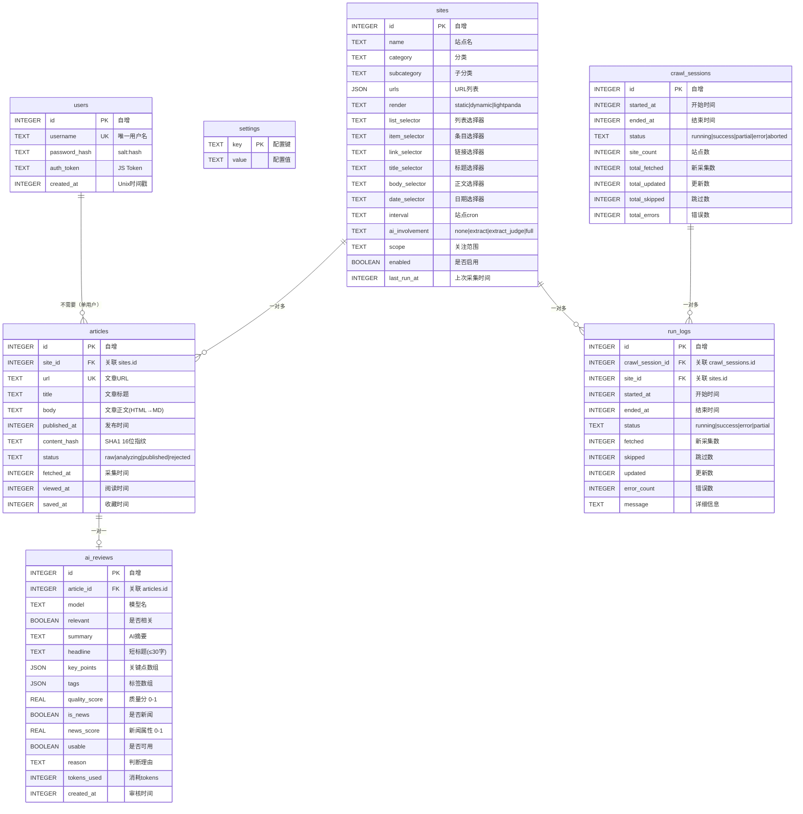

### 4.2 关键索引

| 索引 | 表 | 字段 | 用途 |
|------|-----|------|------|
| `idx_articles_feed` | articles | viewed_at, status, published_at | 资讯流查询加速 |
| `idx_articles_status` | articles | status | AI分析批次扫描 |
| `idx_articles_content_hash` | articles | content_hash | 内容去重 & 已读联动 |

---

## 5. 核心业务链路

### 5.1 端到端流程图

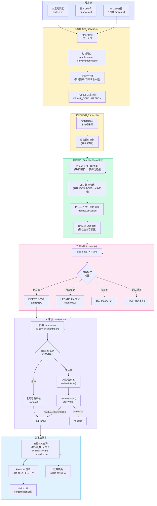

### 5.2 文章生命周期状态机

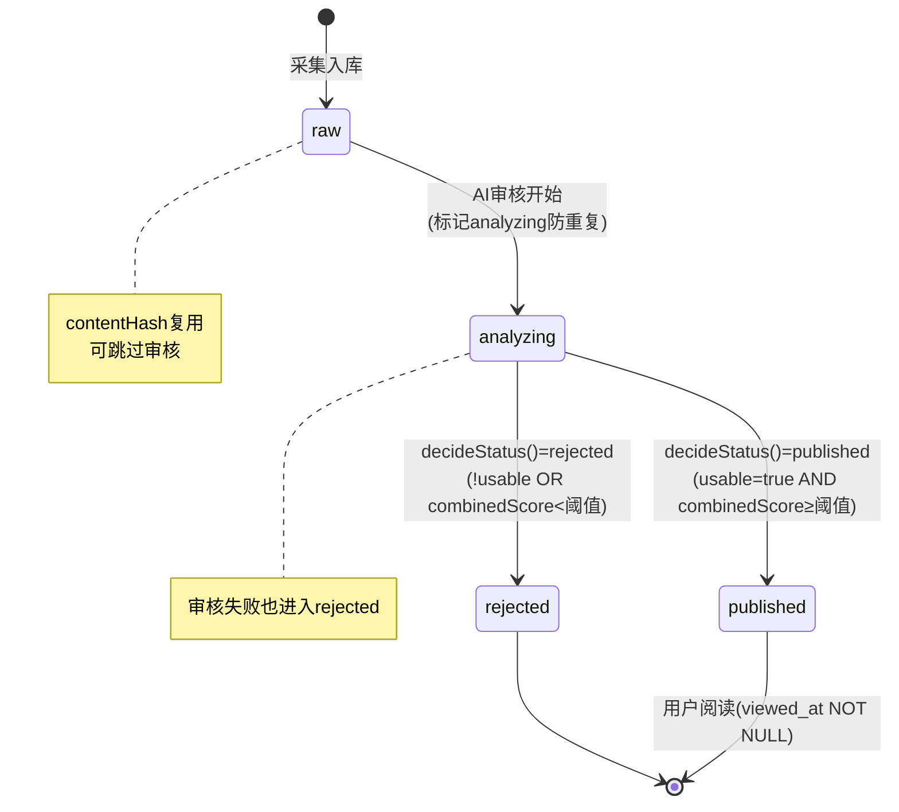

---

## 6. 采集系统详解

### 6.1 三引擎架构

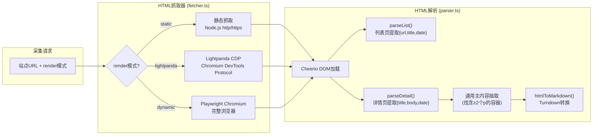

### 6.2 静态抓取器 (fetcher.ts) — TLS容错策略

```mermaid
flowchart TB
    REQ["nativeFetch(url)"]
    AGENT{"使用哪个<br/>TLS Agent?"}
    STANDARD["TLS_AGENT<br/>rejectUnauthorized=false<br/>默认密码套件(含ECDHE)"]
    FALLBACK["TLS_FALLBACK_AGENT<br/>rejectUnauthorized=false<br/>禁用ECDHE/ECDH<br/>仅TLSv1.2"]
    
    SUCCESS{"成功?"}
    SSL_ERR{"SSL错误?"}
    RETRY{"可重试?<br/>(5xx/超时/连接)"}
    BACKOFF["指数退避<br/>1s → 2s → 4s"]
    REDIRECT["处理重定向<br/>(HTTP→HTTPS跨协议)<br/>cookie转发"]
    ENCODING["编码识别<br/>(header charset > meta charset > utf-8)"]
    
    REQ --> AGENT -->|首次| STANDARD --> SUCCESS
    SUCCESS -->|成功| REDIRECT --> ENCODING
    SUCCESS -->|失败| SSL_ERR
    SSL_ERR -->|是| FALLBACK --> SUCCESS
    SSL_ERR -->|否| RETRY
    RETRY -->|是(第1-3次)| BACKOFF --> AGENT
    RETRY -->|否| FAIL["抛出异常"]
```

### 6.3 浏览器池对比

| 特性 | Playwright | Lightpanda |
|------|-----------|------------|
| 内存占用 | ~200-400MB | ~50MB |
| 功能完整性 | 完整Chromium | 精简CDP子集 |
| 支持locale/geolocation | ✅ | ❌ (不支持Emulation域) |
| Docker化 | 必须安装系统依赖 | 独立镜像，开箱即用 |
| 连接方式 | chromium.launch() | chromium.connectOverCDP(ws://) |
| 连接池 | 单例browser, 每次newContext | 服务端多路复用 |
| 适用场景 | SPA/重度JS站点 | 轻度JS渲染站点 |

### 6.4 智能爬虫 (intelligent-crawl.ts)

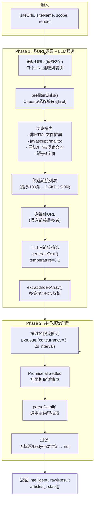

### 6.5 限流策略 (rate-limit.ts)

- 按 **host** 隔离 PQueue
- 每个 domain: concurrency=3 (环境变量 CRAWL_PER_DOMAIN)
- 每个 domain: 2s 窗口内最多 3 个请求
- 同域名站点**串行**执行（避免触发反爬）
- 跨域名**并行**执行（受 CRAWL_CONCURRENCY 控制）

---

## 7. AI 沙盒系统详解

### 7.1 沙盒安全边界

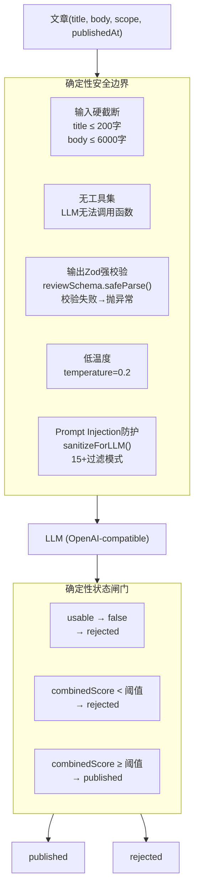

### 7.2 审核输出模型 (schemas.ts)

| 字段 | 类型 | 说明 |
|------|------|------|
| `relevant` | boolean | 内容是否属于 scope 范围 |
| `summary` | string ≤100字 | 中文摘要 |
| `headline` | string ≤30字 | 短标题，用于资讯流展示 |
| `keyPoints` | string[] 3-5条 | 关键信息点 |
| `tags` | string[] 2-5个 | 主题标签 |
| `qualityScore` | number 0-1 | 情报价值/可用性 |
| `usable` | boolean | 是否真实可用（非噪声/导航/公告） |
| `isNews` | boolean | 是否为新闻/资讯类内容 |
| `newsScore` | number 0-1 | 新闻属性评分 |
| `reason` | string | 一句话判断理由 |
| `contentDate` | string\|null YYYY-MM-DD | LLM推断的内容实际日期 |

### 7.3 发布阈值逻辑

```
combinedScore = qualityScore × 0.7 + newsScore × 0.3

if !usable               → rejected
if combinedScore < AI_PUBLISH_THRESHOLD (默认0.5)  → rejected
else                     → published (自动发布)
```

### 7.4 内容去重复用

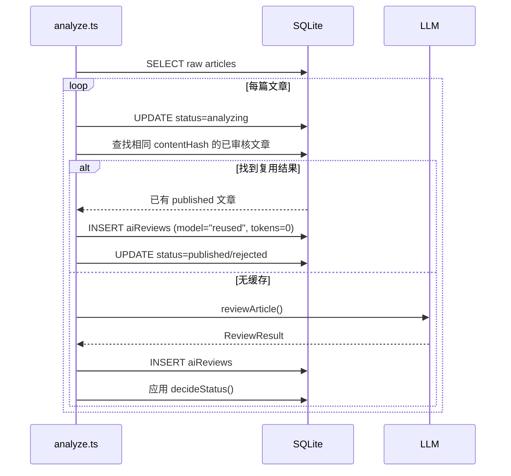

### 7.5 站点分析器 (site-analyzer.ts)

AI 驱动的新站点一键配置（POST `/api/sites/analyze`）：

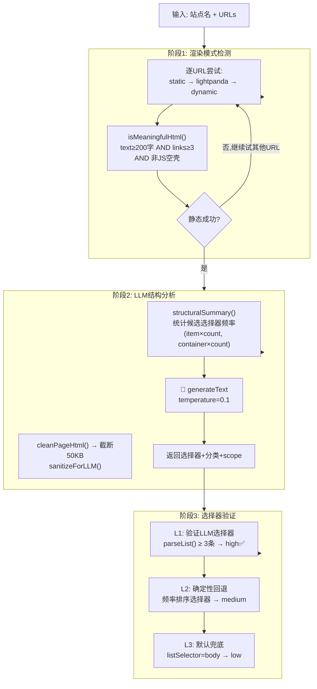

---

## 8. 前端架构

### 8.1 页面路由

| 路径 | 组件 | 渲染模式 | 说明 |
|------|------|----------|------|
| `/` | page.tsx → FeedList | SSR (RSC) | 资讯流首页（近15天未读），SSR首屏+客户端分页 |
| `/login` | login/page.tsx | Client | 登录页（含已登录检测） |
| `/dashboard` | dashboard/page.tsx | SSR | 仪表盘（文章统计+采集进度+调度） |
| `/history` | history/page.tsx | SSR | 已读历史（按阅读时间倒序） |
| `/articles/[id]` | articles/[id]/page.tsx | SSR | 文章详情（正文+AI摘要+审核指标） |
| `/articles` | articles/page.tsx | SSR | 文章列表 |
| `/sites` | sites/page.tsx | SSR | 站点列表 |
| `/sites/[id]` | sites/[id]/page.tsx | Client | 站点编辑 |
| `/sites/new` | sites/new/page.tsx | Client | 新建站点（含AI一键分析） |
| `/runs` | runs/page.tsx | SSR | 采集运行日志 |

### 8.2 组件树

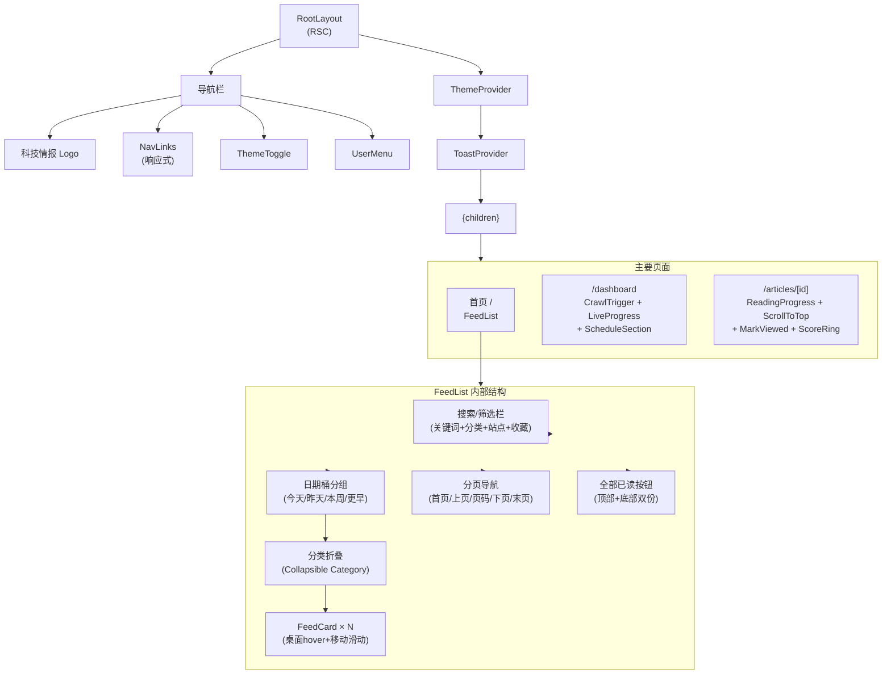

### 8.3 FeedCard 交互设计

| 功能 | 桌面端 | 移动端 |
|------|--------|--------|
| 收藏 | hover 显示星标按钮，点击切换 | 右滑飞过阈值 → 切换收藏 |
| 已读 | hover 显示"已阅读"按钮，点击淡出 | 左滑飞过阈值 → 飞离屏幕标记已读 |
| 入场动画 | CSS animate-card-enter (350ms, 交错delay) | 同桌面 |
| 收藏高亮 | 收藏后卡片边框变琥珀色 | 收藏后显示星标图标 |
| 错误状态 | 按钮变红，4s后自动恢复 | 回弹，4s后自动恢复 |

### 8.4 暗色模式实现

- 使用 Tailwind `dark:` 变体 + CSS class 切换
- `<html class="dark">` → 全局暗色生效
- ThemeProvider 管理状态，localStorage 持久化偏好
- 布局 `<head>` 注入同步脚本防止 FOUC (Flash of Unstyled Content)
- 监听系统偏好变化，用户手动设置后忽略系统变化

---

## 9. 调度系统

### 9.1 调度架构

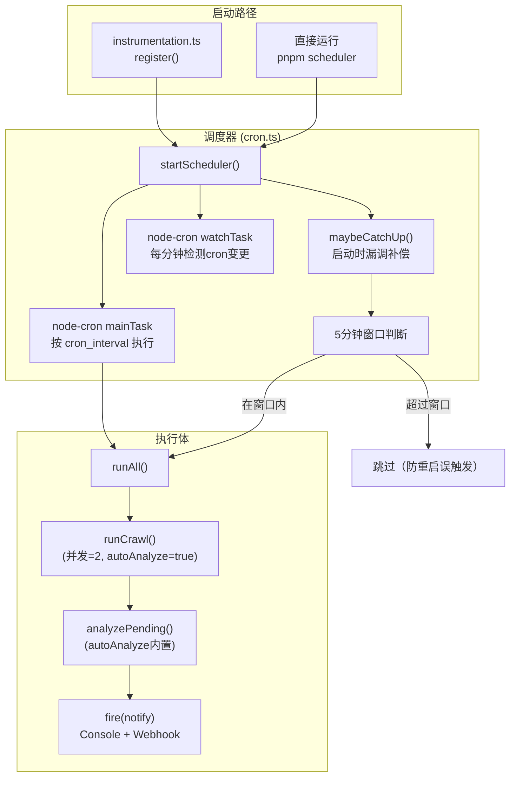

### 9.2 Cron 表达式管理

- 全局 cron 存储在 `settings` 表 (key=`cron_interval`)，默认 `"0 9 * * *"`（每天9点）
- 支持通过 API (`PATCH /api/settings/schedule`) 动态修改
- 每分钟 watch task 检测变更，自动热更新（stop旧任务→start新任务）
- 启动时漏调补偿：若在触发时间过后 5 分钟内启动，自动补执行
- 补执行前检查是否有 running session（防止重复）

---

## 10. 部署架构

### 10.1 Docker 编排

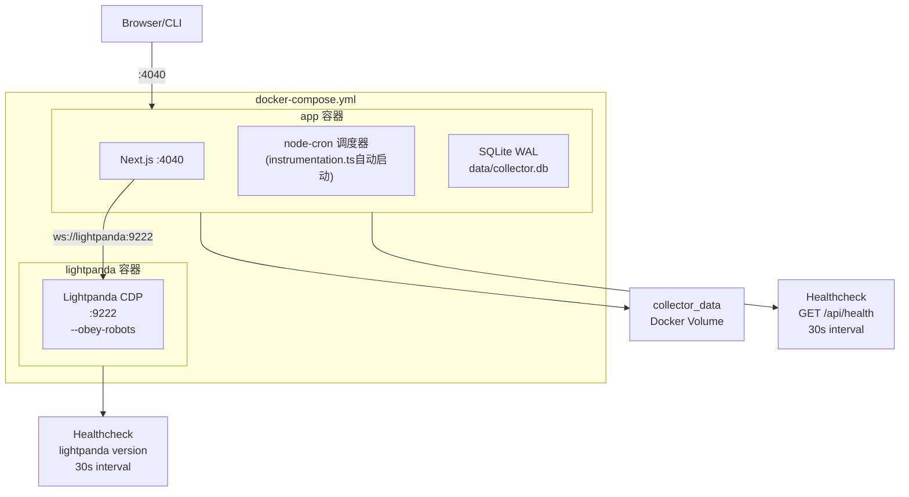

### 10.2 Dockerfile 多阶段构建

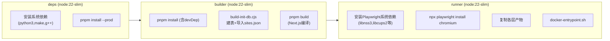

---

## 11. API 路由全景

### 11.1 全部路由一览

| 方法 | 路径 | 认证 | 说明 |
|------|------|------|------|
| `GET` | `/api/health` | ❌ | 健康检查（Docker healthcheck） |
| `POST` | `/api/auth/login` | ❌ | 登录（返回set-cookie） |
| `POST` | `/api/auth/logout` | ❌ | 退出（清除cookie） |
| `GET` | `/api/auth/me` | ❌ | 获取当前用户 |
| `GET` | `/api/feed` | ✅ | 分页查询资讯流 |
| `POST` | `/api/articles/[id]/view` | ✅ | 标记已读（含 contentHash 级联） |
| `POST` | `/api/articles/view-batch` | ✅ | 批量标记已读 |
| `POST` | `/api/articles/[id]/save` | ✅ | 切换收藏状态 |
| `GET` | `/api/history` | ✅ | 分页查询已读历史 |
| `GET` | `/api/sites` | ✅ | 站点列表（含文章计数） |
| `POST` | `/api/sites` | ✅ | 创建站点 |
| `GET` | `/api/sites/[id]` | ✅ | 单站点详情 |
| `PATCH` | `/api/sites/[id]` | ✅ | 更新站点（白名单过滤） |
| `DELETE` | `/api/sites/[id]` | ✅ | 删除站点（有文章时阻止） |
| `POST` | `/api/sites/[id]/toggle` | ✅ | 切换启用/禁用 |
| `POST` | `/api/sites/batch/toggle` | ✅ | 批量切换启用/禁用 |
| `POST` | `/api/sites/analyze` | ✅ | AI 站点结构分析 |
| `POST` | `/api/crawl` | ✅ | 手动触发采集（后台执行） |
| `POST` | `/api/crawl/stop` | ✅ | 中止采集 |
| `GET` | `/api/runs` | ✅ | 分页运行日志 |
| `GET` | `/api/runs/active` | ✅ | 当前进度（running + recent） |
| `GET` | `/api/settings/schedule` | ✅ | 获取 cron 配置 |
| `PATCH` | `/api/settings/schedule` | ✅ | 更新 cron 配置 |

### 11.2 认证流程

```mermaid
sequenceDiagram
    participant Browser
    participant Middleware as middleware.ts
    participant API as API Routes
    participant DB as SQLite
    
    Note over Browser,DB: 登录流程
    Browser->>API: POST /api/auth/login {username, password}
    API->>DB: 查询用户
    API->>API: verifyPassword()
    API->>API: createSignedToken(HMAC-SHA256)
    API-->>Browser: Set-Cookie: auth_token=xxx; HttpOnly; Max-Age=30d
    
    Note over Browser,DB: 认证流程
    Browser->>Middleware: 请求任意受保护路由
    Middleware->>Middleware: 检查 auth_token cookie
    alt 无 cookie
        Middleware-->>Browser: 302 /login
    else 有 cookie
        Middleware-->>Browser: 放行
        Browser->>API: 请求API
        Note over API: layout.tsx验证token有效性
        API->>DB: 查询用户是否存在
    end
```

---

## 12. 安全设计

### 12.1 认证安全

- **密码**：scrypt 哈希 (32字节salt + 64字节key) + timingSafeEqual 恒定时间比较
- **Token**：自签名 HMAC-SHA256 (payload.base64url + signature)，无状态验证
- **Cookie**：HttpOnly, SameSite=Lax, maxAge=30天, path=/
- **CSRF**：SameSite Lax 提供基础保护（API 均为服务端渲染或 fetch，无 form POST）

### 12.2 AI 安全（沙盒）

| 防护层 | 机制 |
|--------|------|
| 输入截断 | title≤200字, body≤6000字（LLM看到的是有界输入） |
| Prompt注入防护 | sanitizeForLLM() — 15+正则模式过滤（ignore previous instructions等） |
| 无工具集 | v1无函数调用能力，LLM无法访问网络/文件/DB |
| Zod强校验 | reviewSchema.safeParse() → 输出不符合schema直接抛异常 |
| 确定性闸门 | decideStatus() 代码决定最终状态，LLM只是建议 |
| 低温度 | temperature=0.2 降低随机性 |
| 日期校验 | sanitizeDates() 兜底：未来日期→修正为今天 |

### 12.3 API 安全

- **站点编辑白名单**：`EDITABLE_FIELDS` Set 只接受合法字段
- **参数校验**：render/aiInvolvement 枚举值校验，urls 数组格式校验
- **删除保护**：有文章的站点禁止删除 (HTTP 409)
- **Cron 校验**：isValidCron() 验证5字段格式与取值范围

---

## 13. 关键设计决策与权衡

### 13.1 为什么用 SQLite 而非 PostgreSQL？

| 考量 | 决策 |
|------|------|
| 部署复杂度 | SQLite 零配置、零进程，Docker 一键启动 |
| 并发需求 | 单用户系统，WAL 模式足够（读写不互斥） |
| 数据规模 | 每日数百条文章，SQLite 轻松胜任 |
| 运维成本 | 无需管理数据库容器、备份即复制文件 |
| 取舍 | 牺牲了多实例横向扩展能力（单机写入瓶颈在 10 万+ 记录后才明显） |

### 13.2 为什么智能爬虫替换了选择器驱动爬虫？

- **维护成本**：逐站配置 CSS 选择器不可持续（每个站点结构不同）
- **鲁棒性**：站点改版后选择器失效，智能爬虫自适应
- **LLM 成本优化**：不分析原始 HTML（50-100KB），而是预筛选链接列表（2-5KB，100条内）
- **智能爬虫 > CSS选择器**：当前 runner.ts 统一走智能爬虫，降级到 CSS 选择器仅在 LLM 失败时

### 13.3 三渲染引擎的适用场景

| 引擎 | 内存 | 适用 | 不适用 |
|------|------|------|--------|
| static (http.get) | ~10MB | 服务端渲染、静态HTML | SPA、JS动态加载内容 |
| lightpanda (CDP) | ~50MB | 轻度JS渲染、DOM内容即可 | 复杂SPA、需要完整浏览器API |
| dynamic (Playwright) | ~200-400MB | 重度SPA、复杂交互 | 静态站点（浪费资源） |

### 13.4 架构演进趋势

```
v0: 手动写死选择器 → 选择器驱动爬虫
v1: 选择器存DB         → sites表存储CSS选择器
v2: AI辅助配置         → site-analyzer.ts 一键分析
v3: 全AI驱动           → 智能爬虫 intelligent-crawl.ts（当前）
```

### 13.5 关键文件依赖图

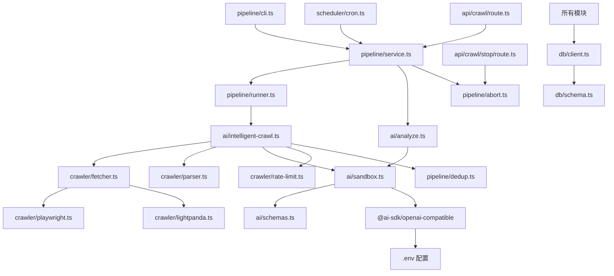

---

## 附录：环境变量完整清单

| 变量 | 默认值 | 说明 |
|------|--------|------|
| `AI_BASE_URL` | (必填) | OpenAI兼容API端点 |
| `AI_API_KEY` | (必填) | API密钥 |
| `AI_MODEL` | (必填) | 模型名 |
| `AI_TIMEOUT_MS` | 60000 | LLM调用超时 |
| `AI_PUBLISH_THRESHOLD` | 0.5 | 自动发布阈值 |
| `AI_REVIEW_TIMEOUT_MS` | 60000 | 单篇审核超时 |
| `ADMIN_USERNAME` | admin | 管理员用户名 |
| `ADMIN_PASSWORD` | change-me | 管理员密码 |
| `AUTH_SECRET` | dev-secret-change-me | Token签名密钥 |
| `CRAWL_CONCURRENCY` | 10→3(Docker) | 跨域名并发数 |
| `CRAWL_PER_DOMAIN` | 3 | 同域名内并发数 |
| `CRAWL_SITE_TIMEOUT_MS` | 300000 | 单站点超时(5分钟) |
| `CRON_INTERVAL` | 0 9 * * * | 定时调度cron |
| `INTELLIGENT_CRAWL_ENABLED` | false (当前忽略) | 智能爬虫开关 |
| `INTELLIGENT_CRAWL_MAX_ITEMS` | 30 | 单站最多文章数 |
| `INTELLIGENT_CRAWL_TIMEOUT_MS` | 120000 | 智能爬虫总超时 |
| `INTELLIGENT_CRAWL_LINK_TIMEOUT` | 45000 | LLM链接筛选超时 |
| `LIGHTPANDA_WS_ENDPOINT` | ws://127.0.0.1:9222 | Lightpanda地址 |
| `LIGHTPANDA_TIMEOUT_MS` | 30000 | Lightpanda请求超时 |
| `LIGHTPANDA_FALLBACK_TO_PLAYWRIGHT` | true | 失败回退开关 |
| `NOTIFY_WEBHOOK_URL` | (空) | 通知Webhook URL |
