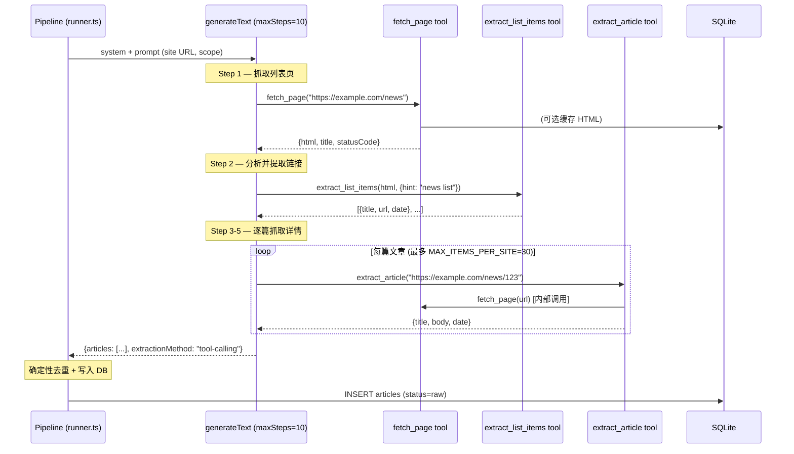

# S18: 智能爬虫 — 基于 AI SDK Tool-Calling 的自适应内容提取

**关联分析**: [ANALYSIS.md](../ANALYSIS.md) → §8 改进建议（新增方案）

**优先级**: M3（中期改进）  
**涉及文件**: `src/ai/sandbox.ts`, `src/crawler/`, `src/pipeline/runner.ts`  
**预估工时**: 16h

---

## 一、背景与动机

### 1.1 当前痛点

项目当前使用**预配置的 CSS 选择器**驱动爬虫：

```
人工配置 listSelector/linkSelector/titleSelector/bodySelector
  → 爬虫用 Cheerio/Playwright 抓取页面
  → 按选择器提取列表项 → 提取详情 → 写入数据库
```

这带来三个问题：

| 问题 | 现状 | 影响 |
|---|---|---|
| **选择器脆弱** | 站点改版后选择器失效，无自动感知 | 静默漏采，用户无感知 |
| **扩展成本高** | 每新增一个站点需人工分析 DOM、配置 5 个选择器 | 从 10 站扩展到 50 站需要大量手工工作 |
| **跳过未配置站点** | `listSelector IS NULL` 的站点直接跳过 | `discover-selectors.ts` 是独立工具，未集成到流水线 |

### 1.2 为什么 tool-calling 是正确方案

当前在 [§二.3 智能爬虫分析](#) 中已指出，tool-calling 的典型场景是**多步自主推理**。爬虫恰好符合：

- LLM 需要**看到页面内容**才能决定如何提取（不是单 pass 能做好的）
- 不同站点结构不同，需要**探索 → 试提取 → 验证 → 修正**的循环
- 每一步的操作（抓取页面、提取链接、解析正文）可以抽象为 tool，由 LLM 编排

这与 S01 中分析的"批量审核不需要 tool-calling"形成对比：审核是单维度的分类+摘要，爬虫是**需要与外部环境交互的多步探索**。

---

## 二、整体架构

### 2.1 新旧架构对比

```
【旧架构：静态选择器】
  配置选择器 → 固定路径爬取 → 输出文章

【新架构：LLM 驱动的自适应爬虫】
  LLM 接收站点 URL
    → 调用 fetch_page tool（获取页面 HTML）
    → 分析 DOM 结构，找到文章列表
    → 调用 extract_list_items tool（提取链接）
    → 调用 fetch_page tool（获取每篇文章详情）
    → 调用 extract_article tool（提取标题/正文/日期）
    → 返回结构化文章列表
```

### 2.2 核心流程图



### 2.3 与现有流水线的集成点

改动集中在两个文件：

```
src/ai/sandbox.ts          ← 新增 intelligentCrawl() 函数（带 tools 的 generateText）
src/crawler/intelligent.ts ← 新增 tool 实现（fetch_page, extract_list_items, extract_article）
src/pipeline/runner.ts     ← runSite() 中添加分支：优先走智能爬虫，回退到选择器
```

`runner.ts` 中的分支逻辑：

```typescript
// src/pipeline/runner.ts — runSite() 内部
export async function runSite(site: Site, sessionId?: number) {
  // ...创建 run_log...

  let articles: RawArticle[];

  if (site.listSelector) {
    // 原有路径：CSS 选择器驱动（不变）
    articles = await crawlWithSelectors(site);
  } else {
    // 新路径：LLM tool-calling 自适应提取
    articles = await intelligentCrawl(site);
  }

  // 后续的去重、contentHash、写入 DB 逻辑完全复用
  // ...
}
```

### 2.4 渐进式策略

| 阶段 | 内容 | 风险 |
|---|---|---|
| **Phase 1** | 仅对 `listSelector IS NULL` 的站点启用智能爬虫（作为回退） | 低 — 这些站点本来就被跳过 |
| **Phase 2** | 对全部站点同时运行选择器+智能爬虫，对比结果验证准确性 | 中 — 需要人工评估差异 |
| **Phase 3** | 智能爬虫成为默认，选择器作为 override（可选） | 中 — 需要性能/成本监控 |
| **Phase 4** | 移除选择器配置，完全由 LLM 驱动 | 高 — 需充分验证后执行 |

---

## 三、核心部件：`fetch_page` Tool

### 3.1 设计目标

`fetch_page` 是智能爬虫的"眼睛"——LLM 通过它看到网页的真实内容。设计上需要在**能力**和**安全**之间取得平衡：

| 维度 | 设计决策 |
|---|---|
| **输入** | 仅接受 URL，不允许注入任意 JS/headers |
| **输出** | 返回清洗后的 HTML 文本（不是原始响应），去除 script/style/注释 |
| **大小限制** | 单页上限 500KB（HTML 原文），超出则截断并标记 `truncated: true` |
| **超时** | 15s（避免 LLM 等待过久） |
| **缓存** | 同一次 `generateText` 调用内，同一 URL 只抓取一次（LRU cache） |
| **编码** | 自动检测 charset，统一转为 UTF-8 |
| **渲染** | 静态站点用 fetch，动态站点用 Playwright（通过 site.render 字段控制） |

### 3.2 Tool Schema（AI SDK v7 格式）

```typescript
// src/crawler/intelligent.ts

import { tool } from "ai";
import { z } from "zod";

export const fetchPageTool = tool({
  description:
    "抓取指定 URL 的网页内容，返回清洗后的 HTML 文本。" +
    "用于获取列表页或文章详情页的内容。" +
    "同一 URL 在一次会话中只会抓取一次（有缓存）。" +
    "返回的 HTML 已去除 script/style/注释，只保留结构化内容。",
  
  inputSchema: z.object({
    url: z.string().url().describe("要抓取的网页 URL"),
    render: z
      .enum(["auto", "static", "dynamic"])
      .default("auto")
      .describe(
        "渲染模式：auto=自动判断（优先静态，超时后尝试动态）；" +
        "static=直接 HTTP 请求；dynamic=使用 Playwright 渲染"
      ),
  }),

  execute: async ({ url, render }, { toolbox }) => {
    // toolbox 提供：abortSignal, sessionCache, logger
    const { abortSignal, sessionCache, logger } = toolbox;

    // 1. 检查缓存（同一次 generateText 调用内复用）
    const cached = sessionCache.get(url);
    if (cached) {
      logger?.debug(`[fetch_page] cache hit: ${url}`);
      return cached;
    }

    // 2. 根据 render 模式获取 HTML
    let html: string;
    let actualRender: "static" | "dynamic" = "static";

    try {
      if (render === "dynamic") {
        html = await fetchDynamic(url, { timeoutMs: 15000, abortSignal });
        actualRender = "dynamic";
      } else {
        html = await fetchStatic(url, { timeoutMs: 15000, abortSignal });
      }
    } catch (err) {
      // 如果 static 失败且 mode=auto，回退到 dynamic
      if (render === "auto") {
        logger?.warn(`[fetch_page] static 失败，回退到 dynamic: ${url}`);
        html = await fetchDynamic(url, { timeoutMs: 15000, abortSignal });
        actualRender = "dynamic";
      } else {
        throw err;
      }
    }

    // 3. 清洗 HTML
    const cleaned = cleanHtml(html);
    
    // 4. 大小限制
    const MAX_BYTES = 500_000;
    const truncated = Buffer.byteLength(cleaned, "utf-8") > MAX_BYTES;
    if (truncated) {
      html = cleaned.slice(0, MAX_BYTES);
    }

    // 5. 提取页面元信息
    const title = extractMetaTitle(html); // <title> 标签内容
    const textPreview = cleaned.replace(/\s+/g, " ").trim().slice(0, 500);

    const result = {
      url,
      title,
      actualRender,
      statusCode: 200,
      truncated,
      byteLength: Buffer.byteLength(cleaned, "utf-8"),
      textPreview,                             // 前 500 字符预览
      body: truncated ? cleaned : cleaned,     // 完整清洗后 HTML
    };

    // 6. 写入缓存
    sessionCache.set(url, result);

    return result;
  },
});
```

### 3.3 关键实现细节

#### 3.3.1 HTML 清洗函数

```typescript
function cleanHtml(rawHtml: string): string {
  // 使用 Cheerio 做一次解析 + 清洗
  const $ = cheerio.load(rawHtml);

  // 移除不需要的标签
  $("script, style, noscript, iframe, svg, " +
    "nav, footer, header, aside, " +
    ".sidebar, .comment, .ad, .advertisement, " +
    ".nav, .navbar, .footer, .header, .menu, " +
    '[role="navigation"], [role="banner"], [role="contentinfo"]'
  ).remove();

  // 移除注释
  $.root().find("*").contents().each(function () {
    if (this.type === "comment") {
      $(this).remove();
    }
  });

  // 移除空标签（递归从叶子开始）
  let changed = true;
  while (changed) {
    changed = false;
    $.root().find("*").each(function () {
      const el = $(this);
      if (
        el.children().length === 0 &&
        !el.text().trim() &&
        !el.attr("src") &&
        !el.attr("href") &&
        !el.is("img, br, hr, input, meta, link")
      ) {
        el.remove();
        changed = true;
      }
    });
  }

  // 移除所有 style 和 event handler 属性
  $.root().find("*").each(function () {
    const el = $(this);
    const attrs = Object.keys(el.attr() || {});
    attrs.forEach((attr) => {
      if (attr.startsWith("on") || attr === "style" || attr === "data-") {
        el.removeAttr(attr);
      }
    });
  });

  // 输出为文本（保留标签结构，用于 LLM 分析 DOM）
  return $.html({ decodeEntities: true });
}
```

#### 3.3.2 会话级缓存

```typescript
// src/crawler/intelligent.ts

class SessionCache {
  private cache = new Map<string, any>();
  private maxSize = 50; // 最多缓存 50 个 URL

  get(key: string) {
    return this.cache.get(key);
  }

  set(key: string, value: any) {
    // LRU 淘汰
    if (this.cache.size >= this.maxSize) {
      const firstKey = this.cache.keys().next().value;
      if (firstKey !== undefined) {
        this.cache.delete(firstKey);
      }
    }
    this.cache.set(key, value);
  }

  clear() {
    this.cache.clear();
  }
}
```

#### 3.3.3 静态抓取（复用现有 fetcher）

```typescript
async function fetchStatic(
  url: string,
  opts: { timeoutMs: number; abortSignal?: AbortSignal }
): Promise<string> {
  // 复用 src/crawler/fetcher.ts 中的 fetchHtml() 逻辑
  // 包括：编码检测、TLS 兼容、重定向处理、GBK 转换
  return fetchHtml(url, { timeoutMs: opts.timeoutMs });
}
```

#### 3.3.4 动态抓取（复用现有 Playwright 池）

```typescript
async function fetchDynamic(
  url: string,
  opts: { timeoutMs: number; abortSignal?: AbortSignal }
): Promise<string> {
  // 复用 src/crawler/playwright.ts 中的 getBrowser() + fetchDynamic()
  const browser = await getBrowser();
  const context = await browser.newContext({
    userAgent: "Mozilla/5.0 (compatible; TechInfoCollector/1.0)",
  });
  const page = await context.newPage();

  try {
    await page.goto(url, {
      waitUntil: "domcontentloaded",
      timeout: opts.timeoutMs,
    });
    await page.waitForLoadState("networkidle", { timeout: 5000 }).catch(() => {});
    await page.waitForTimeout(800); // 安全余量
    return await page.content();
  } finally {
    await context.close();
  }
}
```

---

## 四、辅助 Tool

### 4.1 `extract_list_items` — 从列表页提取链接

```typescript
export const extractListItemsTool = tool({
  description:
    "从清洗后的 HTML 中提取文章列表项（标题、链接、可选日期）。" +
    "根据页面结构分析 DOM，找到重复的文章条目模式。" +
    "返回提取到的链接列表。",
  
  inputSchema: z.object({
    html: z.string().describe("清洗后的 HTML 内容（来自 fetch_page 的输出）"),
    hint: z
      .string()
      .optional()
      .describe("提示，如 'news list'、'blog posts'、'科技政策列表'，帮助定位目标区域"),
  }),

  execute: async ({ html, hint }) => {
    const $ = cheerio.load(html);

    // 策略 1：找所有 <a> 标签，统计父元素的 CSS class/tag 模式
    const links = $("a[href]");
    const containerStats = new Map<string, { count: number; samples: string[] }>();

    links.each((_, el) => {
      const $el = $(el);
      const href = $el.attr("href");
      if (!href || href === "#" || href.startsWith("javascript:")) return;

      const text = $el.text().trim();
      if (text.length < 4) return; // 太短的不是文章链接

      // 获取最近的有 class 的父元素
      const parent = $el.parent();
      const parentTag = parent.get(0)?.tagName || "unknown";
      const parentClass = parent.attr("class")?.split(/\s+/)[0] || "";
      const selector = `${parentTag}.${parentClass}`;

      if (!containerStats.has(selector)) {
        containerStats.set(selector, { count: 0, samples: [] });
      }
      const stat = containerStats.get(selector)!;
      stat.count++;
      if (stat.samples.length < 3) {
        stat.samples.push({ href, text });
      }
    });

    // 找出出现次数最多的容器模式（即是文章列表）
    const sorted = [...containerStats.entries()]
      .filter(([_, v]) => v.count >= 3) // 至少有 3 个条目
      .sort((a, b) => b[1].count - a[1].count);

    if (sorted.length === 0) {
      return { items: [], error: "未能检测到文章列表模式" };
    }

    // 策略 2：尝试从日期选择器中提取日期
    const bestContainer = sorted[0];
    const items: Array<{ title: string; url: string; date: string | null }> = [];

    $(bestContainer[0]).each((_, container) => {
      const $a = $(container).find("a[href]").first();
      if (!$a.length) return;

      const href = $a.attr("href") || "";
      const text = $a.text().trim();
      if (text.length < 4) return;

      // 尝试提取日期
      let date: string | null = null;
      const containerText = $(container).text();
      const dateMatch = containerText.match(
        /(\d{4}[-\/年]\d{1,2}[-\/月]\d{1,2})/
      );
      if (dateMatch) {
        date = dateMatch[1];
      }

      items.push({
        title: text.slice(0, 200),
        url: resolveUrl(href, "https://placeholder.invalid"), // baseUrl 由上下文提供
        date,
      });
    });

    return {
      items: items.slice(0, 50), // 上限 50 条
      containerSelector: bestContainer[0],
      totalFound: items.length,
    };
  },
});
```

### 4.2 `extract_article` — 提取文章详情

```typescript
export const extractArticleTool = tool({
  description:
    "抓取并解析单篇文章详情页，提取标题、正文、发布时间。" +
    "内部会先调用 fetch 获取页面，然后分析 DOM 提取结构化内容。",
  
  inputSchema: z.object({
    url: z.string().url().describe("文章详情页 URL"),
    titleHint: z
      .string()
      .optional()
      .describe("从列表页已知的标题文本，用于在详情页中做匹配验证"),
  }),

  execute: async ({ url, titleHint }, { toolbox }) => {
    // 内部调用 fetch 获取 HTML
    const page = await fetchPageTool.execute!(
      { url, render: "auto" },
      { toolbox }
    );
    
    if (!page || !("body" in page)) {
      throw new Error(`抓取页面失败: ${url}`);
    }

    const html = (page as any).body as string;
    const $ = cheerio.load(html);

    // 1. 提取标题
    let title = "";
    // 优先用 h1
    const h1 = $("h1").first().text().trim();
    if (h1 && h1.length >= 2) {
      title = h1;
    }
    // 回退到 <title>
    if (!title) {
      title = $("title").text().trim();
    }

    // 2. 提取正文
    let body = "";

    // 策略 A：找包含最多 <p> 标签的容器
    const candidates = $("article, .article, .content, .post-content, " +
      ".article-content, .post-body, .entry-content, main, [role='main']");
    
    if (candidates.length > 0) {
      let bestContainer = candidates.first();
      let bestPCount = 0;
      candidates.each((_, el) => {
        const pCount = $(el).find("p").length;
        if (pCount > bestPCount) {
          bestPCount = pCount;
          bestContainer = $(el);
        }
      });
      body = bestContainer.text().trim();
    }

    // 策略 B：回退 — 取 <body> 中所有 <p> 的文本
    if (!body || body.length < 100) {
      body = $("p")
        .map((_, el) => $(el).text().trim())
        .get()
        .filter((t) => t.length > 20)
        .join("\n\n");
    }

    // 3. 提取日期
    let date: string | null = null;
    const datePatterns = [
      /(\d{4}[-\/年]\d{1,2}[-\/月]\d{1,2})/,
      /(\d{4}[-\/年]\d{1,2}[-\/月]\d{1,2}\s*\d{1,2}:\d{2})/,
    ];
    for (const pattern of datePatterns) {
      const match = html.match(pattern);
      if (match) {
        date = match[1];
        break;
      }
    }

    // 4. 清理正文
    body = body
      .replace(/[\t\r]+/g, "\n")
      .replace(/\n{3,}/g, "\n\n")
      .trim()
      .slice(0, 20000); // 上限 20000 字符

    return {
      title: title || (titleHint ?? ""),
      body,
      date,
      url,
    };
  },
});
```

---

## 五、核心入口：`intelligentCrawl()`

```typescript
// src/ai/sandbox.ts 中新增

import { generateText, tool } from "ai";
import { fetchPageTool, extractListItemsTool, extractArticleTool } from "../crawler/intelligent";

export interface IntelligentCrawlResult {
  articles: Array<{
    url: string;
    title: string;
    body: string;
    date: string | null;
  }>;
  extractionMethod: "tool-calling";
  stats: {
    pagesFetched: number;
    listItemsFound: number;
    articlesExtracted: number;
    toolCalls: number;
    tokensUsed: number;
  };
}

export async function intelligentCrawl(input: {
  siteUrl: string;
  siteName: string;
  scope: string | null;
  render: "static" | "dynamic";
}): Promise<IntelligentCrawlResult> {
  const sessionCache = new SessionCache();
  let toolCalls = 0;

  const { output, usage } = await generateText({
    model: getModel(),
    temperature: 0.1,
    maxSteps: 10, // 最多 10 步 tool-calling 循环
    system:
      `你是智能网页爬虫助手。你的任务是：\n` +
      `1. 抓取给定的网站首页/列表页\n` +
      `2. 分析页面结构，找到文章列表区域\n` +
      `3. 提取文章链接列表\n` +
      `4. 对每篇文章，抓取详情页并提取标题、正文、发布时间\n\n` +
      `规则：\n` +
      `- 每次只对需要分析的页面调用 fetch_page（不要重复抓取同一 URL）\n` +
      `- 提取链接时，只取真正的文章/新闻链接，排除导航、关于、联系等页面\n` +
      `- 标题太短（<4字）或链接包含 javascript:/#/void 的跳过\n` +
      `- 最多提取 30 篇文章\n` +
      `- 如果列表页同时是文章页（单页模式），直接提取内容\n\n` +
      `关注范围：${input.scope ?? "科技情报(泛)"}`,
    prompt:
      `请抓取并分析以下网站的内容：\n\n` +
      `站点名称：${input.siteName}\n` +
      `站点 URL：${input.siteUrl}\n` +
      `渲染模式：${input.render}\n` +
      `关注范围：${input.scope ?? "科技情报(泛)"}\n\n` +
      `请先抓取首页，分析结构，然后提取文章列表和详情。`,
    
    tools: {
      fetch_page: {
        ...fetchPageTool,
        execute: async (args) => {
          toolCalls++;
          return fetchPageTool.execute!(args, {
            toolbox: { abortSignal: undefined, sessionCache, logger: console },
          });
        },
      },
      extract_list_items: {
        ...extractListItemsTool,
        execute: async (args) => {
          toolCalls++;
          return extractListItemsTool.execute!(args, {
            toolbox: { abortSignal: undefined, sessionCache, logger: console },
          });
        },
      },
      extract_article: {
        ...extractArticleTool,
        execute: async (args) => {
          toolCalls++;
          return extractArticleTool.execute!(args, {
            toolbox: { abortSignal: undefined, sessionCache, logger: console },
          });
        },
      },
    },

    // 当 LLM 调用 extract_article 达到 30 次或明确完成时停止
    stopWhen: [
      // 总共调用 30 次 extract_article 后停止
      {
        type: "stepCountIs",
        steps: 10,
      },
    ],
  });

  // output 是最后一步 LLM 返回的文本，包含文章列表的 JSON 摘要
  // 但实际的文章数据来自 tool 调用的结果，我们从 session 中重建
  // 更好的方式是让 LLM 在最后一步输出结构化结果

  return {
    articles: [], // TODO: 从 tool 调用历史中提取
    extractionMethod: "tool-calling",
    stats: {
      pagesFetched: sessionCache.size,
      listItemsFound: 0, // 从 tool calls 汇总
      articlesExtracted: 0,
      toolCalls,
      tokensUsed: usage?.totalTokens ?? 0,
    },
  };
}
```

---

## 六、与现有流程的集成

### 6.1 `runner.ts` 改造

```typescript
// src/pipeline/runner.ts

import { intelligentCrawl } from "../ai/sandbox";

export async function runSite(
  site: Site,
  sessionId?: number,
): Promise<RunResult> {
  const runId = createRunLog(site, sessionId);

  let articles: RawArticle[];

  // ── 分支：选择器驱动 vs 智能爬虫 ──
  if (site.listSelector) {
    // 原有路径（不变）
    articles = await crawlWithSelectors(site);
  } else if (site.aiInvolvement !== "none") {
    // 智能爬虫路径（新增）
    console.log(`  🧠 #${site.id} ${site.name} — 使用智能爬虫`);
    const result = await intelligentCrawl({
      siteUrl: site.urls[0],
      siteName: site.name,
      scope: site.scope,
      render: site.render,
    });
    articles = result.articles.map((a) => ({
      url: a.url,
      title: a.title,
      body: a.body,
      publishedAt: a.date ? parseDate(a.date) : null,
      siteId: site.id,
    }));
    console.log(
      `    → ${articles.length} 篇 · ${result.stats.toolCalls} 次 tool 调用 · ${result.stats.tokensUsed} tokens`,
    );
  } else {
    // aiInvolvement === 'none' 且无选择器 → 跳过
    console.log(`  ⊘ #${site.id} ${site.name} — 无选择器且AI未启用，跳过`);
    return { fetched: 0, updated: 0, skipped: 0, errorCount: 0, status: "error" };
  }

  // ── 去重 + contentHash + 写入 DB（完全复用，不变） ──
  return await deduplicateAndSave(articles, site, runId);
}
```

### 6.2 环境变量控制

```bash
# .env 中新增
INTELLIGENT_CRAWL_ENABLED=true      # 是否启用智能爬虫
INTELLIGENT_CRAWL_MAX_STEPS=10      # 最大 tool-calling 步数
INTELLIGENT_CRAWL_MAX_TOKENS=50000  # 单站点最大 token 消耗
INTELLIGENT_CRAWL_MAX_ITEMS=30      # 单站点最多提取文章数
```

### 6.3 超时与安全

```
                    ┌──────────────────────────────────────┐
                    │    intelligentCrawl() 总超时: 120s   │
                    │                                       │
                    │  fetch_page 单次: 15s                 │
                    │  extract_article 单次: 20s            │
                    │  LLM 推理总步数: maxSteps=10          │
                    │                                       │
                    │  超时 → 返回已提取的文章（partial）    │
                    └──────────────────────────────────────┘
```

---

## 七、成本分析

### 7.1 单站点 Token 估算

| 步骤 | 操作 | 输入 Token | 输出 Token |
|---|---|---|---|
| Step 1 | fetch_page(首页) | ~500 | ~2,000 (HTML 返回) |
| Step 2 | extract_list_items | ~2,500 | ~1,000 (链接列表) |
| Step 3-N | extract_article × 15 (均值) | ~3,000 × 15 | ~2,000 × 15 |
| 最终 | LLM 总结输出 | ~30,000 | ~500 |

**总计**: 约 8 万-12 万 tokens / 站点（含 15 篇文章详情）

### 7.2 与当前方案对比

| | 当前（选择器） | 智能爬虫 |
|---|---|---|
| **爬虫成本** | 0（纯确定性代码） | ~10万 tokens ≈ ¥0.05-0.20/站点 |
| **AI 审核成本** | 不变 | 不变（智能爬虫只替换爬虫部分） |
| **10 站点/次** | ¥0 | ¥0.5-2.0 |
| **50 站点/次** | ¥0 | ¥2.5-10.0 |
| **每天 4 次** | ¥0 | ¥2-8/天（10 站） |

关键洞察：**智能爬虫对有选择器的站点是额外开销**，但对无选择器的站点是 0→1 的突破（从"跳过"变为"能采"）。

### 7.3 优化策略

1. **缓存页面内容**：同一站点不同文章共享列表页缓存，减少 fetch_page 调用
2. **增量模式**：如果站点结构未变，复用上次的"提取策略"（LLM 输出的 DOM 路径）而不用重新 tool-calling
3. **选择性启用**：仅对 `listSelector IS NULL` 的站点使用智能爬虫（Phase 1）
4. **混合模式**：用智能爬虫自动发现选择器，写入数据库，后续采集用选择器（零成本）

---

## 八、风险与缓解

| 风险 | 概率 | 影响 | 缓解 |
|---|---|---|---|
| LLM 推理不稳定，提取结果波动 | 中 | 同一站点每次爬到的文章不一致 | 增加 `temperature: 0.1`，对发现的选择器做持久化（混合模式） |
| Token 消耗超出预期 | 中 | 单次采集成本高 | `maxSteps` + `maxTokens` 硬上限，环境变量可控 |
| 爬虫超时（网站慢/LLM 慢） | 高 | 部分站点采集中断 | 总超时 120s，返回 partial 结果 |
| LLM 被注入恶意 JS（通过网页内容） | 低 | 安全风险 | HTML 清洗去除 script/style/注释，500KB 硬上限 |
| 对现有选择器爬虫的影响 | 低 | 引入 bug | 增量改造，选择器路径完全不动；功能开关控制 |

---

## 九、与 AI SDK 的对应关系

| SDK 特性 | 用法 | 说明 |
|---|---|---|
| `generateText` | 核心入口 | 替代当前 `sandbox.ts` 中的单一调用，添加 `tools` + `maxSteps` |
| `tool()` | 定义 3 个 tool | `fetch_page`、`extract_list_items`、`extract_article` |
| `maxSteps` | `10` | 最多 10 步推理循环（含 tool 调用和 LLM 推理） |
| `stopWhen` | `stepCountIs(10)` | 硬上限，防止无限循环 |
| `temperature` | `0.1` | 爬虫需要确定性，比审核（0.2）更低 |
| `output.object()` | 最终输出 | LLM 最后一步返回结构化 `{articles: [...], stats: {...}}` |

---

## 十、验证计划

### 10.1 单元测试

1. `fetch_page tool` — 正常抓取、超时、缓存命中、编码转换
2. `extract_list_items tool` — 不同页面结构的链接提取（表格、列表、卡片）
3. `extract_article tool` — 标题提取优先级、正文容器检测、日期解析

### 10.2 集成测试

1. 对当前 10 个种子站点运行智能爬虫
2. 对比智能爬虫 vs 选择器爬虫的结果（标题一致率、正文完整度、遗漏率）
3. 对当前因缺少选择器被跳过的站点（机器之心）运行智能爬虫，验证是否能提取内容

### 10.3 验收标准

| 指标 | 目标 |
|---|---|
| 有选择器的站点（9 个），智能爬虫 vs 选择器：标题一致率 | ≥ 80% |
| 无选择器的站点（机器之心），能提取到文章 | ≥ 5 篇 |
| 单站点完成时间 | ≤ 120s |
| 单站点 token 消耗 | ≤ 15万 |
| 误提取率（导航/关于页被当作文章） | ≤ 10% |

---

## 十一、扩展方向

当智能爬虫验证稳定后，可进一步扩展到：

1. **分页自动发现**：LLM 检测到 "下一页" 链接后自动翻页抓取
2. **站点结构变更检测**：定期用智能爬虫验证选择器是否仍然有效，失效时自动更新
3. **多 URL 探索**：对 `site.urls` 中的多个入口 URL 分别分析，选择最优的列表页
4. **反爬自适应**：LLM 检测到验证码/登录页/403 后，自动调整策略（等待、换 UA、降频）
5. **内容分类自学习**：LLM 在爬虫阶段就做初步分类（新闻/公告/文档/招聘），减少后续 AI 审核的工作量
